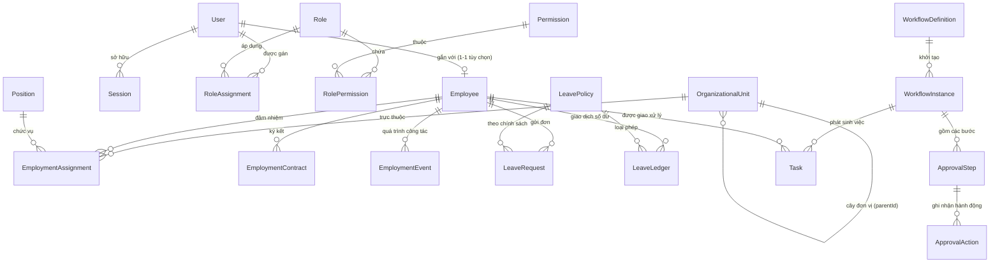

# MÔ HÌNH DỮ LIỆU & THỰC THỂ LÕI (DOMAIN MODEL & ERD)
## Hệ thống Quản trị Nhân sự Thông minh - Trường Đại học Kiến trúc Đà Nẵng (DAU)

---

### 1. Nguyên tắc Thiết kế Dữ liệu
1. **Tách biệt Danh tính và Hồ sơ**:
   - `User`: Phục vụ xác thực, quản lý mật khẩu, khóa đăng nhập và phiên làm việc.
   - `Employee`: Chứa toàn bộ thông tin nhân thân, bằng cấp, chức vụ và quá trình công tác. Khi một giảng viên nghỉ việc hoặc tài khoản bị khóa, hồ sơ `Employee` và lịch sử công tác vẫn được bảo lưu vĩnh viễn theo quy định lưu trữ của trường.
2. **Quản lý Kiêm nhiệm và Lịch sử có ngày hiệu lực**:
   - Một `Employee` có thể có 1 vị trí chính (`PRIMARY`) và nhiều vị trí kiêm nhiệm (`CONCURRENT`) tại các đơn vị khác nhau qua bảng `EmploymentAssignment`.
   - Mọi thay đổi về chức vụ, đơn vị, thăng tiến đều sinh một bản ghi lịch sử `EmploymentEvent`.
3. **Nguyên tắc Sổ cái Bất biến (Immutable Ledger)**:
   - Số dư ngày phép không được lưu dưới dạng một con số tùy tiện cộng trừ. Mọi biến động (cấp phép đầu năm, sử dụng, hoàn phép, điều chỉnh) đều lưu thành các giao dịch ghi nợ/ghi có trong `LeaveLedger`.
4. **Tách biệt 3 tầng dữ liệu Chấm công**:
   - Tầng 1: Dữ liệu gốc (`AttendanceImport`).
   - Tầng 2: Dữ liệu điều chỉnh có phê duyệt (`AttendanceAdjustment`).
   - Tầng 3: Bảng công tổng hợp theo kỳ đã khóa (`AttendanceRecord`, `AttendancePeriod`).

---

### 2. Sơ đồ Quan hệ Thực thể Khái niệm (Conceptual ERD)

---

### 3. Chi tiết các Phân hệ Thực thể

#### 3.1. Phân hệ Danh tính & Phân quyền (Identity & Access)
- **`User`**:
  - `id`: UUIDv7 (Khóa chính)
  - `email`: Varchar(255) (Duy nhất, email trường @dau.edu.vn hoặc cá nhân)
  - `passwordHash`: Varchar(255) (Argon2id)
  - `status`: Enum (`ACTIVE`, `INACTIVE`, `SUSPENDED`)
  - `isMfaEnabled`: Boolean (Mặc định false)
  - `mfaSecret`: Varchar(255) (Null)
  - `lastLoginAt`: Timestamp with timezone
  - `createdAt`, `updatedAt`
- **`Session`**:
  - `id`: UUIDv7 (Mã phiên lưu trong Cookie HttpOnly)
  - `userId`: UUIDv7 (Khóa ngoại -> `User.id`)
  - `ipAddress`: Varchar(45)
  - `userAgent`: Text
  - `expiresAt`: Timestamp with timezone
  - `createdAt`: Timestamp with timezone
- **`Role`**:
  - `id`: UUIDv7
  - `code`: Varchar(50) (Duy nhất: `ROLE_EMPLOYEE`, `ROLE_UNIT_HEAD`, `ROLE_HR_OFFICER`, `ROLE_RECTOR`, `ROLE_SYSADMIN`)
  - `name`: Varchar(100)
  - `description`: Text
- **`Permission`**:
  - `id`: UUIDv7
  - `code`: Varchar(100) (Duy nhất: `employee:read`, `employee:create`, `leave:approve`, `attendance:lock`...)
  - `module`: Varchar(50) (`EMPLOYEE`, `LEAVE`, `ATTENDANCE`, `WORKFLOW`, `REPORT`)
  - `action`: Varchar(50) (`CREATE`, `READ`, `UPDATE`, `DELETE`, `APPROVE`, `EXPORT`)
- **`RolePermission`**:
  - `roleId`: UUIDv7
  - `permissionId`: UUIDv7
- **`RoleAssignment`**:
  - `id`: UUIDv7
  - `userId`: UUIDv7
  - `roleId`: UUIDv7
  - `scopeUnitId`: UUIDv7 (Null = Áp dụng toàn trường; Nếu có giá trị = Giới hạn quyền trong Đơn vị đó và cấp con)
  - `validFrom`: Date
  - `validTo`: Date (Null = Vô thời hạn)

---

#### 3.2. Phân hệ Cơ cấu Tổ chức & Hồ sơ Nhân sự (DAU Core HR)
- **`OrganizationalUnit`** (Đơn vị trong trường):
  - `id`: UUIDv7
  - `code`: Varchar(50) (Duy nhất: `BGH`, `K_KT`, `BM_KTCT`, `P_TCHC`, `P_DT`...)
  - `name`: Varchar(255) (Ví dụ: "Khoa Kiến trúc", "Bộ môn Kiến trúc công trình", "Phòng Tổ chức - Hành chính")
  - `unitType`: Enum (`BOARD`, `FACULTY`, `DEPARTMENT`, `DIVISION`, `CENTER`)
  - `parentId`: UUIDv7 (Khóa ngoại tự tham chiếu -> `OrganizationalUnit.id`, hình thành cấu trúc cây tổ chức)
  - `managerEmployeeId`: UUIDv7 (Khóa ngoại -> `Employee.id`, Người đứng đầu đơn vị)
  - `isActive`: Boolean (Mặc định true)
  - `orderIndex`: Integer (Thứ tự sắp xếp trên sơ đồ)
- **`Position`** (Chức vụ & Chức danh):
  - `id`: UUIDv7
  - `code`: Varchar(50) (`TRUONG_KHOA`, `PHO_KHOA`, `TRUONG_BO_MON`, `GIANG_VIEN`, `CHUYEN_VIEN`, `HIEU_TRUONG`...)
  - `name`: Varchar(255)
  - `positionType`: Enum (`MANAGEMENT`, `ACADEMIC`, `ADMINISTRATIVE`)
  - `leadershipLevel`: Integer (Cấp độ lãnh đạo: 1 = BGH, 2 = Trưởng Khoa/Phòng, 3 = Trưởng Bộ môn, 0 = Không giữ chức vụ)
- **`Employee`** (Hồ sơ Cán bộ Giảng viên Nhân viên):
  - `id`: UUIDv7
  - `userId`: UUIDv7 (Tùy chọn, 1-1 với `User.id`)
  - `employeeCode`: Varchar(50) (Duy nhất: ví dụ `CB0001`, `GV0123`)
  - `fullName`: Varchar(255)
  - `gender`: Enum (`MALE`, `FEMALE`, `OTHER`)
  - `dateOfBirth`: Date
  - `idCardNumber`: Varchar(20) (Số CCCD - Dữ liệu nhạy cảm)
  - `idCardIssueDate`: Date
  - `idCardIssuePlace`: Varchar(255)
  - `taxCode`: Varchar(20)
  - `personalEmail`: Varchar(255)
  - `workEmail`: Varchar(255)
  - `phoneNumber`: Varchar(20)
  - `currentAddress`: Text
  - `academicTitle`: Enum (`NONE`, `ASSOCIATE_PROFESSOR`, `PROFESSOR`) (Học hàm: PGS, GS)
  - `academicDegree`: Enum (`BACHELOR`, `MASTER`, `DOCTOR`) (Học vị: Cử nhân/Kỹ sư, ThS, TS)
  - `employmentStatus`: Enum (`PROBATION`, `ACTIVE`, `ON_LEAVE`, `RESIGNED`, `RETIRED`)
  - `hireDate`: Date
- **`EmploymentAssignment`** (Phân công công tác & Kiêm nhiệm):
  - `id`: UUIDv7
  - `employeeId`: UUIDv7
  - `unitId`: UUIDv7
  - `positionId`: UUIDv7
  - `assignmentType`: Enum (`PRIMARY`, `CONCURRENT`) (Chính thức hoặc Kiêm nhiệm)
  - `isHeadOfUnit`: Boolean (Có phải là người phụ trách cao nhất của đơn vị hay không)
  - `startDate`: Date
  - `endDate`: Date (Null nếu còn hiệu lực)
  - `status`: Enum (`ACTIVE`, `EXPIRED`, `TERMINATED`)
- **`EmploymentContract`** (Hợp đồng lao động):
  - `id`: UUIDv7
  - `employeeId`: UUIDv7
  - `contractNumber`: Varchar(100) (Số hợp đồng: ví dụ `HDLD-2026/012-DAU`)
  - `contractType`: Enum (`PROBATION`, `DEFINITE_TERM_12M`, `DEFINITE_TERM_36M`, `INDEFINITE_TERM`, `VISITING_LECTURER`)
  - `signedDate`: Date
  - `effectiveDate`: Date
  - `expiryDate`: Date (Null đối với hợp đồng không xác định thời hạn)
  - `salaryCoefficient`: Decimal(5,2) (Hệ số lương)
  - `status`: Enum (`DRAFT`, `ACTIVE`, `EXPIRED`, `TERMINATED`, `RENEWED`)
  - `fileAssetId`: UUIDv7 (File scan hợp đồng)
  - `parentContractId`: UUIDv7 (Liên kết hợp đồng gốc nếu là phụ lục hoặc gia hạn)
- **`EmploymentEvent`** (Lịch sử biến động công tác):
  - `id`: UUIDv7
  - `employeeId`: UUIDv7
  - `eventType`: Enum (`HIRED`, `APPOINTED`, `TRANSFERRED`, `CONCURRENT_ASSIGNED`, `PROMOTED`, `RESIGNED`, `RETIRED`)
  - `decisionNumber`: Varchar(100) (Số quyết định của Hiệu trưởng)
  - `decisionDate`: Date
  - `effectiveDate`: Date
  - `fromUnitId`: UUIDv7 (Null nếu tuyển mới)
  - `toUnitId`: UUIDv7
  - `fromPositionId`: UUIDv7
  - `toPositionId`: UUIDv7
  - `note`: Text
  - `fileAssetId`: UUIDv7 (File đính kèm quyết định)

---

#### 3.3. Phân hệ Quản lý Nghỉ phép & Công tác (Leave & Business Trip)
- **`LeavePolicy`** (Chính sách nghỉ phép):
  - `id`: UUIDv7
  - `code`: Varchar(50) (`ANNUAL_LEAVE`, `SICK_LEAVE`, `MATERNITY_LEAVE`, `UNPAID_LEAVE`, `BEREAVEMENT_LEAVE`)
  - `name`: Varchar(255)
  - `annualAllowanceDays`: Decimal(4,1) (Số ngày được cấp mỗi năm: ví dụ 12 ngày)
  - `requiresAttachment`: Boolean
  - `maxConsecutiveDays`: Integer
  - `carryOverLimitDays`: Decimal(4,1) (Số ngày phép tối đa được chuyển sang năm sau)
- **`LeaveLedger`** (Sổ cái giao dịch ngày phép - Bất biến):
  - `id`: UUIDv7
  - `employeeId`: UUIDv7
  - `policyId`: UUIDv7
  - `fiscalYear`: Integer (Năm tài chính, ví dụ 2026)
  - `transactionType`: Enum (`INITIAL_GRANT`, `MONTHLY_ACCRUAL`, `USED`, `RESTORED`, `EXPIRED`, `MANUAL_ADJUSTMENT`)
  - `amount`: Decimal(4,1) (Dương nếu cộng, Âm nếu trừ)
  - `balanceAfter`: Decimal(4,1) (Số dư tính toán tại thời điểm giao dịch)
  - `referenceRequestId`: UUIDv7 (Liên kết tới `LeaveRequest.id` tương ứng)
  - `reason`: Text
  - `createdAt`: Timestamp with timezone
  - `createdById`: UUIDv7
- **`LeaveRequest`** (Đơn xin nghỉ phép):
  - `id`: UUIDv7
  - `requestCode`: Varchar(50) (Duy nhất: `NP-YYYYMM-XXXX`)
  - `employeeId`: UUIDv7
  - `policyId`: UUIDv7
  - `startDate`: Date
  - `endDate`: Date
  - `startPeriod`: Enum (`FULL_DAY`, `MORNING`, `AFTERNOON`)
  - `endPeriod`: Enum (`FULL_DAY`, `MORNING`, `AFTERNOON`)
  - `totalDays`: Decimal(4,1)
  - `reason`: Text
  - `handoverWork`: Text (Bàn giao công việc/giờ giảng dạy)
  - `substituteEmployeeId`: UUIDv7 (Người nhận bàn giao công việc)
  - `attachmentFileId`: UUIDv7
  - `status`: Enum (`DRAFT`, `PENDING_APPROVAL`, `APPROVED`, `REJECTED`, `CANCELLED`)
  - `workflowInstanceId`: UUIDv7
- **`BusinessTripRequest`** (Đơn cử/đăng ký công tác):
  - `id`: UUIDv7
  - `requestCode`: Varchar(50) (Duy nhất: `CT-YYYYMM-XXXX`)
  - `employeeId`: UUIDv7
  - `destination`: Varchar(255)
  - `purpose`: Text
  - `startDate`: Date
  - `endDate`: Date
  - `transportation`: Varchar(100)
  - `estimatedBudget`: Decimal(15,2)
  - `status`: Enum (`DRAFT`, `PENDING_APPROVAL`, `APPROVED`, `REJECTED`, `CANCELLED`)
  - `workflowInstanceId`: UUIDv7

---

#### 3.4. Phân hệ Workflow Phê duyệt Dùng chung (Shared Workflow Engine)
- **`WorkflowDefinition`**:
  - `id`: UUIDv7
  - `code`: Varchar(50) (`WF_LEAVE_DEFAULT`, `WF_BUSINESS_TRIP`, `WF_ATTENDANCE_ADJ`)
  - `name`: Varchar(255)
  - `module`: Enum (`LEAVE`, `BUSINESS_TRIP`, `ATTENDANCE_ADJUSTMENT`, `PROFILE_UPDATE`)
  - `version`: Integer
  - `isActive`: Boolean
- **`WorkflowInstance`**:
  - `id`: UUIDv7
  - `definitionId`: UUIDv7
  - `entityType`: Varchar(50) (`LeaveRequest`, `BusinessTripRequest`...)
  - `entityId`: UUIDv7
  - `currentStepOrder`: Integer
  - `status`: Enum (`RUNNING`, `COMPLETED`, `REJECTED`, `CANCELLED`)
  - `startedAt`: Timestamp with timezone
  - `completedAt`: Timestamp with timezone
- **`ApprovalStep`**:
  - `id`: UUIDv7
  - `instanceId`: UUIDv7
  - `stepOrder`: Integer (1, 2, 3...)
  - `stepName`: Varchar(100) ("Trưởng Bộ môn/Khoa duyệt", "Phòng TCHC duyệt", "Ban Giám hiệu duyệt")
  - `assignedEmployeeId`: UUIDv7 (Người được chỉ định phê duyệt tại bước này)
  - `fallbackRoleId`: UUIDv7 (Vai trò dự phòng nếu vị trí lãnh đạo đang khuyết)
  - `status`: Enum (`PENDING`, `APPROVED`, `REJECTED`, `RETURNED`, `ESCALATED`, `SKIPPED`)
  - `dueDate`: Timestamp with timezone
  - `completedAt`: Timestamp with timezone
- **`ApprovalAction`**:
  - `id`: UUIDv7
  - `stepId`: UUIDv7
  - `actorEmployeeId`: UUIDv7
  - `action`: Enum (`APPROVE`, `REJECT`, `REQUEST_CHANGE`, `ESCALATE`, `REASSIGN`)
  - `comment`: Text
  - `createdAt`: Timestamp with timezone
- **`Task`** (Công việc chờ xử lý):
  - `id`: UUIDv7
  - `assignedEmployeeId`: UUIDv7
  - `workflowInstanceId`: UUIDv7
  - `stepId`: UUIDv7
  - `title`: Varchar(255)
  - `linkUrl`: Varchar(255)
  - `priority`: Enum (`LOW`, `NORMAL`, `HIGH`, `URGENT`)
  - `status`: Enum (`OPEN`, `DONE`, `CANCELLED`)

---

#### 3.5. Hạ tầng Kỹ thuật (Technical Infrastructure)
- **`FileAsset`**:
  - `id`: UUIDv7
  - `originalFileName`: Varchar(255)
  - `storedFileName`: Varchar(255) (Tên file UUID trên ổ cứng)
  - `mimeType`: Varchar(100)
  - `fileSizeBytes`: BigInt
  - `sha256Checksum`: Varchar(64)
  - `storagePath`: Varchar(500)
  - `accessLevel`: Enum (`PUBLIC`, `INTERNAL`, `CONFIDENTIAL`)
  - `uploadedByUserId`: UUIDv7
- **`OutboxEvent`**:
  - `id`: UUIDv7
  - `aggregateType`: Varchar(100)
  - `aggregateId`: UUIDv7
  - `eventType`: Varchar(100)
  - `payload`: Jsonb
  - `idempotencyKey`: Varchar(255) (Duy nhất)
  - `status`: Enum (`PENDING`, `PROCESSING`, `PROCESSED`, `FAILED`)
  - `retryCount`: Integer (Mặc định 0)
  - `lastError`: Text
  - `createdAt`: Timestamp with timezone
  - `processedAt`: Timestamp with timezone
- **`AuditEvent`**:
  - `id`: UUIDv7
  - `userId`: UUIDv7 (Tùy chọn)
  - `action`: Varchar(100) (`LOGIN`, `LOGOUT`, `UPDATE_EMPLOYEE`, `APPROVE_LEAVE`...)
  - `entityName`: Varchar(100)
  - `entityId`: UUIDv7
  - `ipAddress`: Varchar(45)
  - `userAgent`: Text
  - `diffData`: Jsonb (Lưu các trường thay đổi {old: ..., new: ...})
  - `createdAt`: Timestamp with timezone
