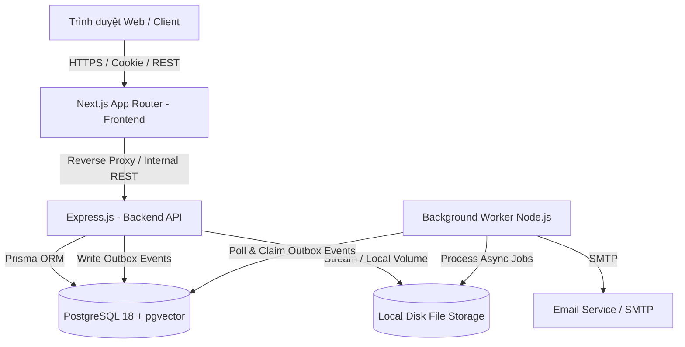
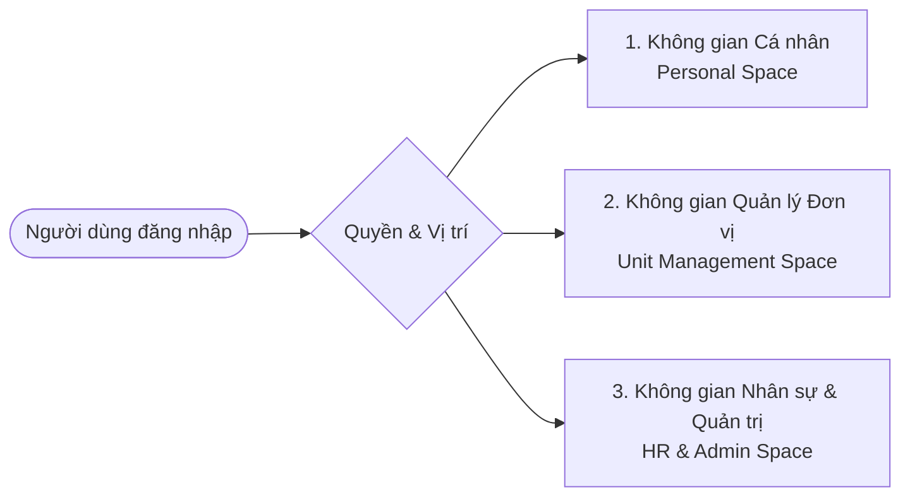
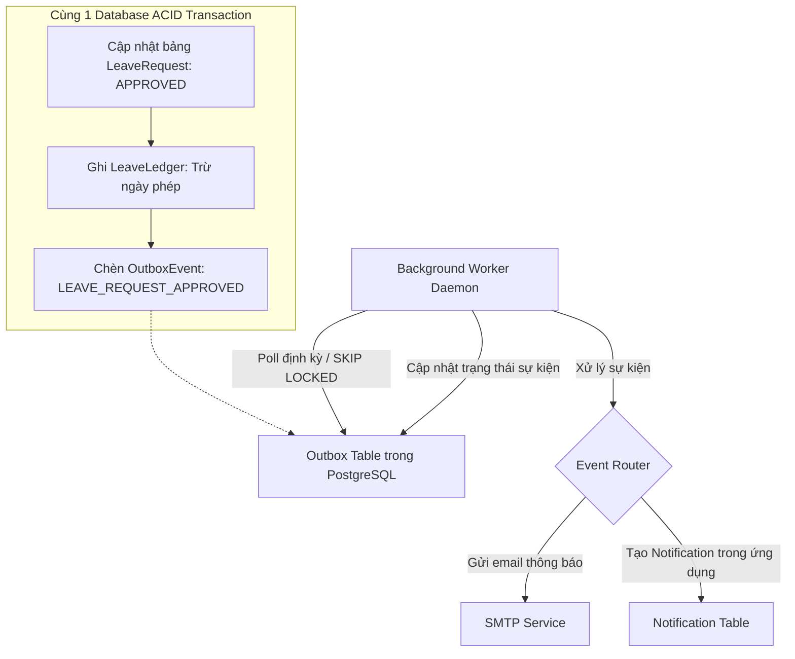

# KIẾN TRÚC TỔNG THỂ HỆ THỐNG (SYSTEM OVERVIEW)
## Hệ thống Quản trị Nhân sự Thông minh - Trường Đại học Kiến trúc Đà Nẵng (DAU)

---

### 1. Bối cảnh và Mục tiêu Hệ thống
Hệ thống **BAHAU** (Smart HRMS for Da Nang Architecture University) được xây dựng nhằm tập trung hóa toàn bộ dữ liệu nhân sự, số hóa các quy trình hành chính – học thuật, tự phục vụ cho cán bộ giảng viên và nâng cao hiệu quả điều hành cho lãnh đạo nhà trường.

Hệ thống tuân thủ các nguyên tắc:
- **Dữ liệu đúng**: Phân tách rõ ràng giữa danh tính tài khoản (`User`) và hồ sơ chuyên môn (`Employee`). Lưu vết lịch sử và ngày hiệu lực cho mọi biến động nhân sự.
- **Quyền đúng**: Phân quyền ma trận đa chiều (Vai trò + Phạm vi đơn vị + Quan hệ sở hữu bản ghi + Trạng thái nghiệp vụ).
- **Quy trình đúng**: Phê duyệt phân cấp tự động theo chuỗi quản lý, chống tự phê duyệt (Self-approval).
- **Giao dịch nhất quán**: Áp dụng Sổ cái giao dịch (Ledger) cho số dư phép và Transactional Outbox cho thông báo/tác vụ nền.

---

### 2. Kiến trúc Mức Cao (C4 Container Diagram)



#### 2.1. Phân chia trách nhiệm các thành phần
1. **Next.js Frontend (`apps/web`)**:
   - Giao diện người dùng trên Next.js App Router, SSR/CSR kết hợp.
   - Quản lý state phía client, validate biểu mẫu bằng Zod schemas dùng chung từ `packages/contracts`.
   - Tuyệt đối không truy cập trực tiếp Database hay bypass tầng nghiệp vụ của Express.
2. **Express Backend API (`apps/api`)**:
   - Trọng tâm xử lý toàn bộ nghiệp vụ, phân quyền đa chiều, xác thực phiên làm việc.
   - Giao tiếp Database thông qua Prisma Client từ `packages/database`.
   - Quản lý giao dịch ACID, ghi nhận Audit Log và Transactional Outbox.
3. **Background Worker (`apps/worker`)**:
   - Tiến trình nền độc lập, đảm nhiệm xử lý sự kiện bất đồng bộ từ bảng `OutboxEvent`.
   - Gửi email thông báo, quét nhắc việc quá hạn, quét cảnh báo hợp đồng sắp hết hạn định kỳ.
   - Thử lại có kiểm soát (exponential backoff) và chống trùng lặp xử lý (Idempotency).
4. **PostgreSQL Database**:
   - Lưu trữ dữ liệu quan hệ, ràng buộc toàn vẹn khóa ngoại.
   - Tích hợp sẵn `pgvector` phục vụ giai đoạn mở rộng AI/RAG.
5. **Local Disk Storage**:
   - Lưu trữ file scan hợp đồng, văn bằng, minh chứng KPI và tài liệu nội bộ tại thư mục bảo mật.
   - Truy cập file bắt buộc đi qua Express API streaming có kiểm tra quyền truy cập.

---

### 3. Mô hình Trải nghiệm Người dùng: 3 Không gian làm việc (3-Space Model)

Hệ thống tổ chức giao diện theo 3 không gian chuyên biệt, tự động cấp quyền truy cập dựa trên thông tin người dùng:



1. **Không gian Cá nhân (Personal Space)**:
   - *Đối tượng*: Dành cho 100% Cán bộ, Giảng viên, Nhân viên (CBGVNV).
   - *Chức năng*: Xem và cập nhật thông tin cá nhân (SĐT, địa chỉ), tạo đơn xin nghỉ phép, nộp yêu cầu công tác, xem bảng công cá nhân, theo dõi số dư phép, tự đánh giá KPI, nộp chứng chỉ mới và theo dõi trạng thái các yêu cầu đang gửi.
2. **Không gian Quản lý Đơn vị (Unit Management Space)**:
   - *Đối tượng*: Trưởng/Phó Khoa, Trưởng/Phó Phòng ban, Trưởng Bộ môn.
   - *Chức năng*: Theo dõi danh sách nhân sự thuộc đơn vị, phê duyệt đơn từ cấp dưới theo chuỗi quản lý phân cấp, đánh giá KPI nhân viên trong đơn vị, đối chiếu bảng chấm công đơn vị.
   - *Tính năng kiêm nhiệm*: Tích hợp bộ chọn đơn vị (`Unit Selector`) tại thanh điều hướng cho các nhân sự phụ trách nhiều đơn vị cùng lúc.
3. **Không gian Nhân sự & Quản trị (HR & Admin Space)**:
   - *Đối tượng*: Chuyên viên Phòng Tổ chức - Hành chính, Ban Giám hiệu, Quản trị hệ thống (SysAdmin).
   - *Chức năng*: Quản lý toàn bộ hồ sơ nhân sự trường, quản lý hợp đồng lao động, cấu hình danh mục cơ cấu tổ chức & chức vụ, điều chuyển nhân sự, thiết lập kỳ đánh giá KPI, chốt kỳ chấm công, cấu hình workflow và xem báo cáo tổng hợp.

---

### 4. Cơ chế Xác thực & Quản lý Phiên (Stateful Session Authentication)

Nhằm đảm bảo an toàn tuyệt đối cho dữ liệu nhân sự của trường và tuân thủ Luật Bảo vệ dữ liệu cá nhân:

```mermaid
sequenceDiagram
    autonumber
    actor Client as Trình duyệt (Client)
    participant Next as Next.js Web
    participant Express as Express API
    participant DB as PostgreSQL (Session Table)

    Client->>Express: POST /api/v1/auth/login (email, password)
    Express->>DB: Kiểm tra User & verify password hash (argon2id)
    Express->>DB: Tạo bản ghi Session mới (id, userId, ipAddress, userAgent, expiresAt)
    Express-->>Client: Set-Cookie: sid=SESSION_UUID; HttpOnly; Secure; SameSite=Lax; Path=/
    Note over Client,Express: Các request tiếp theo tự động gửi kèm Cookie sid
    Client->>Express: GET /api/v1/employees/me (Cookie: sid)
    Express->>DB: Query Session & User & Permissions (Cache / In-Memory lookup)
    Express-->>Client: Trả dữ liệu hồ sơ cá nhân
    Client->>Express: POST /api/v1/auth/logout
    Express->>DB: Xóa bản ghi Session tương ứng (Revoke tức thời)
    Express-->>Client: Clear-Cookie sid
```

- **Đặc điểm bảo mật**:
  - Session ID lưu trong Cookie `HttpOnly`, `Secure`, cấm hoàn toàn JavaScript phía client truy cập, triệt tiêu nguy cơ rò rỉ token qua XSS.
  - Hỗ trợ thu hồi phiên (revoke) tức thời khi tài khoản bị khóa hoặc người dùng yêu cầu đăng xuất khỏi mọi thiết bị.
  - Bảo vệ chống CSRF thông qua cơ chế Header `X-Requested-With` và Double-submit CSRF token đối với các thao tác thay đổi dữ liệu (POST, PUT, DELETE).
  - Tích hợp chuẩn bị sẵn sàng mở rộng xác thực 2 bước (TOTP MFA) cho tài khoản quản trị và lãnh đạo.

---

### 5. Cơ chế Xử lý Tác vụ Nền (Transactional Outbox Pattern)

Mọi thay đổi trạng thái nghiệp vụ tạo ra sự kiện (như gửi đơn mới, phê duyệt, từ chối) được ghi trong cùng một Transaction với sự kiện Outbox:



- **Ưu điểm**:
  - Không bao giờ xảy ra tình trạng "đơn đã duyệt nhưng thông báo bị mất" hoặc ngược lại.
  - Worker sử dụng cơ chế `SELECT ... FOR UPDATE SKIP LOCKED` cho phép chạy đa luồng an toàn mà không lo xung đột bản ghi.
  - Đảm bảo tính lũy kế (Idempotency): mỗi sự kiện có `idempotencyKey` duy nhất, không gửi trùng lặp email khi retry.

---

### 6. Quản lý Lưu trữ File (Protected Local Storage Provider)

1. **Nguyên tắc lưu trữ**:
   - File upload (hợp đồng scan, bằng cấp, ảnh đại diện, minh chứng) được lưu tại thư mục cục bộ `storage/uploads` tách biệt khỏi source code.
   - Tên file trên đĩa được sinh ngẫu nhiên bằng UUID để tránh va chạm và path traversal.
   - Bảng `FileAsset` lưu thông tin metadata: tên gốc, MIME type, kích thước file, hash SHA-256, người sở hữu và quyền truy cập (`accessLevel`: `PUBLIC`, `INTERNAL`, `CONFIDENTIAL`).
2. **Quy trình truy xuất**:
   - File có tính chất bảo mật (hợp đồng lao động, thông tin kỷ luật, căn cước) không có URL truy cập trực tiếp công khai.
   - Mọi lượt tải đều qua endpoint `GET /api/v1/files/:id/download`. Express kiểm tra quyền của phiên làm việc hiện tại trước khi tạo stream file trả về cho người dùng.
   - Kiến trúc xây dựng dựa trên `FileStorageProvider` interface, cho phép dễ dàng chuyển đổi sang AWS S3 hoặc MinIO sau này mà không phải sửa logic nghiệp vụ.
