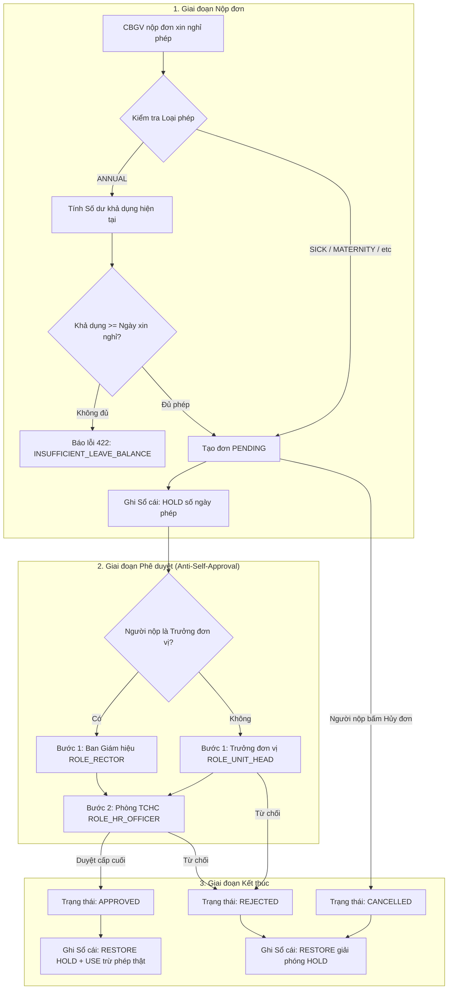

# ĐẶC TẢ YÊU CẦU NGHIỆP VỤ (PRD) & USER STORIES
## Phân hệ 2: Động cơ Workflow Dùng chung, Quản lý Nghỉ phép & Công tác (Leave & Trip)
### Hệ thống Quản trị Nhân sự Thông minh — Trường Đại học Kiến trúc Đà Nẵng (DAU)

---

## 📌 1. MỤC TIÊU VÀ PHẠM VI PHÂN HỆ

### 1.1. Mục tiêu chiến lược
Phân hệ **Workflow Dùng chung + Quản lý Nghỉ phép & Công tác** xây dựng nền tảng phê duyệt tự động hóa không giấy tờ (paperless administration) dành cho toàn thể Cán bộ Giảng viên Nhân viên (CBGVNV) Trường Đại học Kiến trúc Đà Nẵng (DAU).

Trọng tâm của phân hệ là:
1. **Động cơ Workflow đa cấp linh hoạt**: Một engine dùng chung hỗ trợ mọi module nghiệp vụ có quy trình phê duyệt (`LEAVE`, `BUSINESS_TRIP`, `PROFILE_UPDATE`, `ATTENDANCE_ADJUSTMENT`, `CERTIFICATE_VERIFY`).
2. **Cơ chế Chống Tự Duyệt (Anti-Self-Approval)**: Loại bỏ triệt để xung đột lợi ích khi cán bộ quản lý (Trưởng khoa, Trưởng phòng) tự nộp đơn nghỉ phép hoặc công tác — tự động leo thang luồng duyệt lên Ban Giám hiệu (Hiệu trưởng / Phó Hiệu trưởng phụ trách).
3. **Sổ cái Ngày phép Bất biến (Double-entry Leave Ledger)**: Tuyệt đối không dùng một biến `remainingDays` tĩnh dễ sai lệch hoặc bị can thiệp trái phép. Mọi biến động ngày phép đều ghi thành dòng nhật ký giao dịch không thể sửa xóa (`GRANT_ANNUAL`, `CARRY_FORWARD`, `HOLD`, `USE`, `RESTORE`, `EXPIRE`).
4. **Đặc thù khối Giảng dạy Đại học**: Hỗ trợ đăng ký Giảng viên dạy thay (`substituteEmployeeId`) khi nộp đơn nghỉ phép để đảm bảo tiến độ đào tạo của nhà trường không bị gián đoạn.

---

## 🏛️ 2. QUY TẮC NGHIỆP VỤ CỐT LÕI (CRUCIAL BUSINESS RULES)

### Rule 1: Cơ chế Anti-Self-Approval (Chống tự phê duyệt)
1. Cán bộ/Giảng viên bình thường:
   - **Cấp 1**: Trưởng đơn vị phụ trách trực tiếp (`ROLE_UNIT_HEAD`).
   - **Cấp 2**: Phòng Tổ chức - Hành chính thẩm định hồ sơ và vào sổ (`ROLE_HR_OFFICER`).
2. Trưởng đơn vị (Trưởng khoa, Trưởng phòng, Trưởng bộ môn độc lập):
   - Không được phép tự duyệt đơn của mình.
   - Luồng duyệt tự động leo thang: **Cấp 1** chuyển thẳng lên **Ban Giám hiệu** (`ROLE_RECTOR`), **Cấp 2** chuyển về Phòng TCHC (`ROLE_HR_OFFICER`).
3. Thành viên Ban Giám hiệu (Hiệu trưởng / Phó Hiệu trưởng):
   - Hồ sơ do Hiệu trưởng hoặc Ban Giám hiệu thông qua, Phòng TCHC lưu trữ và giám sát.

### Rule 2: Cơ chế Sổ cái Kép Ngày phép (Immutable Double-entry Leave Ledger)
1. **Số dư khả dụng (Available Balance)**:
   $$\text{Remaining} = \max(0, \text{TotalGranted} + \text{CarriedForward} - \text{Used} - \text{PendingHold})$$
2. **Khi nộp đơn nghỉ phép năm (`ANNUAL`)**:
   - Ghi bản ghi `HOLD` với số ngày xin nghỉ.
   - Nếu `Remaining < Số ngày xin nghỉ` $\rightarrow$ Chặn ngay từ đầu với mã lỗi `INSUFFICIENT_LEAVE_BALANCE` (HTTP 422).
3. **Khi đơn được duyệt xong cấp cuối (`APPROVED`)**:
   - Ghi bản ghi `RESTORE` (giải phóng số ngày đã HOLD).
   - Ghi bản ghi `USE` (ghi giảm số dư thực tế).
4. **Khi đơn bị từ chối (`REJECTED`) hoặc bị hủy (`CANCELLED`)**:
   - Ghi bản ghi `RESTORE` (giải phóng số ngày đã HOLD).
   - Số dư thực tế giữ nguyên vẹn.
5. **Hỗ trợ nửa ngày công**:
   - Hệ thống cho phép nghỉ 0.5 ngày (buổi sáng hoặc buổi chiều).

---

## 📋 3. DANH SÁCH 10 USER STORIES CHI TIẾT

### US-01: Xem Bảng Tổng quan Số dư Ngày phép Cá nhân
- **Actor**: Toàn thể CBGVNV (`ROLE_EMPLOYEE`).
- **Mô tả**: Tôi muốn theo dõi chi tiết số ngày phép năm được cấp, số ngày đã chuyển từ năm trước, số ngày đang chờ duyệt (HOLD), số ngày đã nghỉ (USE) và số ngày còn lại khả dụng trong năm hiện hành.
- **Tiêu chí nghiệm thu**:
  - Hiển thị 5 chỉ số thẻ (Stat Cards) rõ ràng.
  - Có thanh tỷ lệ phần trăm sử dụng phép trực quan.
  - Cập nhật số liệu tức thì ngay sau khi nộp đơn hoặc được duyệt.

### US-02: Nộp Đơn Xin Nghỉ phép Trực tuyến
- **Actor**: Toàn thể CBGVNV (`ROLE_EMPLOYEE`).
- **Mô tả**: Tôi muốn nộp đơn xin nghỉ phép (nghỉ năm, ốm đau, thai sản, việc riêng, học thuật) kèm lý do và chỉ định đồng nghiệp dạy/làm thay.
- **Tiêu chí nghiệm thu**:
  - Chọn loại phép: `ANNUAL`, `SICK`, `MATERNITY`, `UNPAID`, `BEREAVEMENT`, `WEDDING`, `ACADEMIC`.
  - Validate ngày kết thúc $\ge$ ngày bắt đầu.
  - Kiểm tra số dư phép nếu là `ANNUAL`.
  - Chọn người dạy thay từ danh sách nhân sự của trường.
  - Tự động kích hoạt luồng Workflow tương ứng.

### US-03: Lịch sử và Theo dõi Tiến độ Đơn Nghỉ phép
- **Actor**: Toàn thể CBGVNV (`ROLE_EMPLOYEE`).
- **Mô tả**: Tôi muốn xem danh sách các đơn đã gửi, kèm huy hiệu trạng thái và xem được timeline người nào đang thụ lý bước duyệt của tôi.
- **Tiêu chí nghiệm thu**:
  - Bảng danh sách sắp xếp theo thời gian gửi mới nhất.
  - Bộ lọc trạng thái: `Tất cả`, `Đang chờ duyệt`, `Đã duyệt`, `Đã từ chối`, `Đã hủy`.
  - Bấm vào đơn mở Modal hiển thị dòng thời gian từng bước duyệt (ai duyệt, chức danh, ngày giờ, nhận xét).

### US-04: Hủy Đơn Nghỉ phép khi Đang Chờ Duyệt
- **Actor**: Người nộp đơn (`ROLE_EMPLOYEE`).
- **Mô tả**: Tôi muốn hủy đơn xin nghỉ phép nếu kế hoạch cá nhân thay đổi trước khi cấp có thẩm quyền phê duyệt xong.
- **Tiêu chí nghiệm thu**:
  - Chỉ cho phép hủy khi trạng thái đơn là `PENDING`.
  - Khi hủy thành công: Cập nhật đơn thành `CANCELLED`, giải phóng số ngày phép đang bị `HOLD` trên sổ cái.

### US-05: Đăng ký Kế hoạch Đi Công tác (Business Trip)
- **Actor**: Toàn thể CBGVNV (`ROLE_EMPLOYEE`).
- **Mô tả**: Tôi muốn lập tờ trình đăng ký đi công tác trong hoặc ngoài nước, dự toán kinh phí và nêu rõ nguồn kinh phí tài trợ.
- **Tiêu chí nghiệm thu**:
  - Nhập: Mục đích công tác, Địa điểm đến, Ngày bắt đầu, Ngày kết thúc, Số ngày, Dự toán kinh phí (VNĐ), Nguồn kinh phí (Ngân sách trường, Đề tài NCKH, Dự án tài trợ...).
  - Đơn sinh phiên phê duyệt 2 cấp: Trưởng đơn vị $\rightarrow$ Ban Giám hiệu.

### US-06: Hộp thư Tác vụ Phê duyệt Tập trung (Approval Inbox)
- **Actor**: Trưởng đơn vị (`ROLE_UNIT_HEAD`), Lãnh đạo Trường (`ROLE_RECTOR`), Chuyên viên Nhân sự (`ROLE_HR_OFFICER`).
- **Mô tả**: Tôi muốn có một trung tâm xử lý tác vụ hiển thị toàn bộ các hồ sơ (nghỉ phép, công tác) đang chờ tôi ký duyệt.
- **Tiêu chí nghiệm thu**:
  - Endpoint `GET /api/v1/workflow/pending` trả về chính xác các bước đang ở trạng thái `WAITING` thuộc thẩm quyền của người đăng nhập.
  - Đếm số lượng tác vụ chưa xử lý trên thanh điều hướng.
  - Phân loại theo loại hồ sơ (Nghỉ phép vs Công tác).

### US-07: Phê duyệt Bước trong Quy trình
- **Actor**: Người có thẩm quyền theo phân công bước duyệt.
- **Mô tả**: Tôi muốn phê duyệt bước được giao kèm ý kiến/lời dặn gửi tới người nộp đơn.
- **Tiêu chí nghiệm thu**:
  - Kiểm tra quyền: Người duyệt phải đúng `approverEmployeeId` hoặc sở hữu vai trò `approverRoleCode`.
  - Cập nhật trạng thái bước thành `APPROVED`, ghi nhận `actionAt` và `comment`.
  - Nếu còn bước tiếp theo: tăng `currentStepIndex` lên 1.
  - Nếu là bước cuối cùng: cập nhật Instance thành `APPROVED`, cập nhật đơn nghiệp vụ thành `APPROVED` và kích hoạt hook kế toán phép (chuyển HOLD sang USE).

### US-08: Từ chối Đơn Kèm Lý do Bắt buộc
- **Actor**: Người có thẩm quyền phê duyệt.
- **Mô tả**: Tôi muốn từ chối hồ sơ không hợp lệ và giải thích lý do cụ thể cho người nộp biết để bổ sung, sửa đổi.
- **Tiêu chí nghiệm thu**:
  - Bắt buộc nhập lý do từ chối (tối thiểu 3 ký tự).
  - Cập nhật bước hiện tại thành `REJECTED`, cập nhật Instance thành `REJECTED`.
  - Đơn nghiệp vụ chuyển thành `REJECTED`.
  - Hook tự động giải phóng ngày phép đang bị `HOLD` trả lại cho nhân sự.

### US-09: Xem Lịch sử Biến động Sổ cái Ngày phép (Leave Ledger History)
- **Actor**: CBGVNV (xem của mình), Chuyên viên Nhân sự (xem toàn trường).
- **Mô tả**: Tôi muốn xem bảng kê chi tiết từng giao dịch cộng/trừ ngày phép để đảm bảo tính minh bạch.
- **Tiêu chí nghiệm thu**:
  - Liệt kê đầy đủ: Ngày giờ giao dịch, Loại hành động (`Cấp phép`, `Tạm giữ`, `Trừ phép`, `Hoàn trả`), Số ngày, Số dư sau giao dịch, Mã đơn tham chiếu và Ghi chú.

### US-10: Tra cứu và Quản lý Đơn Công tác Cá nhân
- **Actor**: Toàn thể CBGVNV (`ROLE_EMPLOYEE`).
- **Mô tả**: Tôi muốn theo dõi toàn bộ các chuyến công tác của mình trong năm học, tiến độ ký duyệt của Ban Giám hiệu để chủ động đặt vé tàu xe và liên hệ đối tác.
- **Tiêu chí nghiệm thu**:
  - Bảng danh sách chuyến công tác, lọc theo trạng thái.
  - Chi tiết dự toán kinh phí và tiến trình phê duyệt quyết định cử đi công tác.

---

## 🔌 4. ĐẶC TẢ HỢP ĐỒNG API & SCHEMA (API SPECIFICATION)

| Method | Endpoint | Yêu cầu Quyền | Mục đích |
|---|---|---|---|
| `POST` | `/api/v1/leave/requests` | `ROLE_EMPLOYEE` | Nộp đơn xin nghỉ phép mới |
| `GET` | `/api/v1/leave/requests/my` | `ROLE_EMPLOYEE` | Lấy danh sách đơn nghỉ phép của bản thân |
| `GET` | `/api/v1/leave/requests/:id` | Chủ đơn / Approver / HR | Xem chi tiết đơn + tiến trình workflow |
| `POST` | `/api/v1/leave/requests/:id/cancel` | Chủ đơn | Hủy đơn nghỉ phép khi đang PENDING |
| `GET` | `/api/v1/leave/balance/my` | `ROLE_EMPLOYEE` | Lấy số dư phép năm hiện hành |
| `GET` | `/api/v1/leave/ledger/my` | `ROLE_EMPLOYEE` | Lấy lịch sử biến động sổ cái ngày phép |
| `POST` | `/api/v1/trips/requests` | `ROLE_EMPLOYEE` | Đăng ký chuyến công tác mới |
| `GET` | `/api/v1/trips/requests/my` | `ROLE_EMPLOYEE` | Danh sách chuyến công tác của bản thân |
| `GET` | `/api/v1/trips/requests/:id` | Chủ đơn / Approver / HR | Xem chi tiết công tác + tiến trình workflow |
| `POST` | `/api/v1/trips/requests/:id/cancel` | Chủ đơn | Hủy đơn công tác khi đang PENDING |
| `GET` | `/api/v1/workflow/pending` | Approver | Lấy danh sách tác vụ đang chờ duyệt |
| `GET` | `/api/v1/workflow/instances/:id` | Liên quan | Lấy chi tiết timeline của một phiên workflow |
| `POST` | `/api/v1/workflow/steps/:id/approve` | Approver | Phê duyệt bước hiện tại |
| `POST` | `/api/v1/workflow/steps/:id/reject` | Approver | Từ chối hồ sơ kèm lý do |

---

## 🎨 5. ĐẶC TẢ GIAO DIỆN NGƯỜI DÙNG (UI/UX SPECIFICATION)

1. **Màn hình Nghỉ phép (`/leave`)**:
   - Header: Tiêu đề "Quản lý Nghỉ phép", Nút bấm "Nộp đơn xin nghỉ phép mới".
   - Stats Grid: 4 thẻ số liệu màu sắc DAU chuẩn mực:
     - Số ngày được cấp năm nay.
     - Số ngày phép năm trước chuyển sang.
     - Số ngày đang chờ duyệt (HOLD).
     - Số dư khả dụng hiện tại.
   - Form Drawer / Modal: Form nộp đơn có tính toán thời gian tự động, kiểm tra số dư theo thời gian thực.
   - Table Tabs: "Đơn xin nghỉ phép của tôi" và "Lịch sử Sổ cái ngày phép".
   - Detail Dialog: Timeline trực quan hiển thị từng bước duyệt, trạng thái hoàn thành kèm avatar/tên người duyệt.

2. **Màn hình Công tác (`/trips`)**:
   - Form đăng ký đi công tác trực quan với ô nhập số ngày, dự toán kinh phí định dạng tiền tệ VNĐ.
   - Bảng danh sách chuyến công tác kèm thông tin điểm đến, mục đích và tiến trình phê duyệt của BGH.

3. **Màn hình Phê duyệt (`/approvals`)**:
   - Giao diện dạng Hộp thư tác vụ (Inbox view): Thanh bên lọc theo loại hồ sơ (`Tất cả`, `Nghỉ phép`, `Công tác`).
   - Danh sách thẻ tác vụ: Tên người gửi, Mã CBGV, Ngày gửi, Nội dung tóm lược, Nút "Phê duyệt" và "Từ chối" tiện dụng một chạm.
   - Modal phê duyệt / từ chối có validation trường ý kiến rõ ràng.
