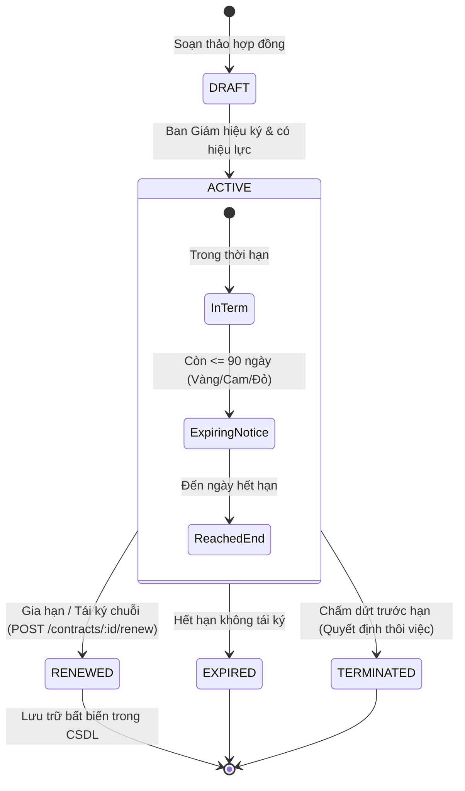
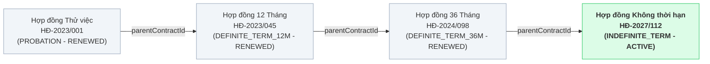

# ĐẶC TẢ YÊU CẦU NGHIỆP VỤ & KỸ THUẬT (PRD)
## PHÂN HỆ 3: QUẢN LÝ HỢP ĐỒNG LAO ĐỘNG & DIỄN BIẾN CÔNG TÁC
### Hệ thống Quản trị Nhân sự Thông minh BAHAU — Trường Đại học Kiến trúc Đà Nẵng (DAU)

---

## 📌 1. TỔNG QUAN PHÂN HỆ & BỐI CẢNH

Quản lý Hợp đồng Lao động và Diễn biến Công tác là một trong những nghiệp vụ cốt lõi hàng đầu của **Phòng Tổ chức - Hành chính (TCHC)** tại Trường Đại học Kiến trúc Đà Nẵng (DAU).

### 1.1. Mục tiêu
1. **Quản trị Vòng đời Hợp đồng Toàn diện**:
   - Quản lý đầy đủ các loại hợp đồng theo quy định Bộ luật Lao động và quy chế DAU: Thử việc (`PROBATION`), Xác định thời hạn 12 tháng (`DEFINITE_TERM_12M`), Xác định thời hạn 36 tháng (`DEFINITE_TERM_36M`), Không xác định thời hạn (`INDEFINITE_TERM`), và Giảng viên thỉnh giảng (`VISITING_LECTURER`).
   - Đảm bảo tính pháp lý, lưu vết lịch sử ký kết và tệp số hóa hợp đồng gốc (`FileAsset`).
2. **Quy tắc Chuỗi Gia hạn Bất biến (Immutable Renewal Chain)**:
   - Khi tái ký, gia hạn hoặc ký phụ lục điều chỉnh hợp đồng, **tuyệt đối không ghi đè** lên bản ghi hợp đồng cũ.
   - Bản ghi mới kế thừa `parentContractId` chỉ về hợp đồng trước đó. Hợp đồng cũ chuyển trạng thái sang `RENEWED`, hợp đồng mới nhận trạng thái `ACTIVE`. Tạo thành cây lịch sử hợp đồng minh bạch phục vụ thanh tra và kiểm toán.
3. **Động cơ Cảnh báo Hết hạn Chủ động (Contract Expiry Alert Engine)**:
   - Tự động phát hiện các hợp đồng sắp hết hạn trong 3 mốc cảnh báo:
     - $\le 30$ ngày: **Cảnh báo Đỏ** (Khẩn cấp — Cần gửi thông báo tái ký/chấm dứt ngay).
     - $31 - 60$ ngày: **Cảnh báo Cam** (Chuẩn bị hồ sơ đánh giá viên chức/người lao động).
     - $61 - 90$ ngày: **Cảnh báo Vàng** (Lập danh sách theo dõi định kỳ quý).
4. **Dòng Thời Gian Diễn Biến Công Tác (Career Progression Timeline)**:
   - Ghi nhận mọi mốc sự kiện quan trọng trong sự nghiệp của cán bộ, giảng viên: Tuyển dụng (`HIRED`), Bổ nhiệm (`APPOINTED`), Điều chuyển (`TRANSFERRED`), Kiêm nhiệm (`CONCURRENT_ASSIGNED`), Nâng ngạch/thăng hạng chức danh (`PROMOTED`), Thôi việc (`RESIGNED`), Nghỉ hưu (`RETIRED`).
   - Gắn liền với Số quyết định, Ngày ký, Ngày hiệu lực, Đơn vị/Vị trí trước và sau biến động.
   - Hỗ trợ cơ chế **Auto-Sync Assignment**: Tự động cập nhật `EmploymentAssignment` (chuyển phân công cũ sang `EXPIRED`, kích hoạt phân công mới `ACTIVE`) khi có quyết định Bổ nhiệm hoặc Điều chuyển.

---

## 👥 2. MA TRẬN PHÂN QUYỀN TRUY CẬP (RBAC & SCOPE)

Áp dụng chặt chẽ ma trận phân quyền đã ban hành tại `docs/requirements/rbac-matrix.md`:

| Hành động nghiệp vụ | Endpoint API | CBGVNV (`ROLE_EMPLOYEE`) | Trưởng đơn vị (`ROLE_UNIT_HEAD`) | Phòng TCHC (`ROLE_HR_OFFICER`) | Ban Giám hiệu (`ROLE_RECTOR`) | Quản trị (`ROLE_SYSADMIN`) |
| :--- | :--- | :---: | :---: | :---: | :---: | :---: |
| Xem danh sách hợp đồng | `GET /contracts` | `SCOPE_SELF` (chỉ bản thân) | `SCOPE_UNIT_TREE` (đơn vị phụ trách) | `SCOPE_ALL` (toàn trường) | `SCOPE_ALL` (toàn trường) | `SCOPE_ALL` |
| Xem thống kê cảnh báo hết hạn | `GET /contracts/summary/alerts` | ❌ Không có quyền | Xem cảnh báo đơn vị | Xem toàn trường | Xem toàn trường | Xem toàn trường |
| Xem chi tiết hợp đồng & chuỗi | `GET /contracts/:id` | `SCOPE_SELF` | `SCOPE_UNIT_TREE` | `SCOPE_ALL` | `SCOPE_ALL` | `SCOPE_ALL` |
| Tạo hợp đồng mới | `POST /contracts` | ❌ | ❌ | ✅ Toàn quyền | ✅ Ký duyệt | ✅ |
| Gia hạn hợp đồng / Tái ký chuỗi | `POST /contracts/:id/renew` | ❌ | ❌ | ✅ Soạn thảo/Thực hiện | ✅ Ký duyệt | ✅ |
| Xem dòng thời gian công tác | `GET /employees/:id/events` | `SCOPE_SELF` | `SCOPE_UNIT_TREE` | `SCOPE_ALL` | `SCOPE_ALL` | `SCOPE_ALL` |
| Ghi nhận quyết định công tác | `POST /employees/:id/events` | ❌ | ❌ | ✅ Toàn quyền | ✅ Phê duyệt | ✅ |

---

## 🎯 3. DANH SÁCH USER STORIES (US)

### US-CT01: Soạn thảo và Ký kết Hợp đồng Lao động Mới
- **Người dùng**: Chuyên viên Phòng TCHC (`ROLE_HR_OFFICER`).
- **Mục tiêu**: Lập một hợp đồng lao động mới cho nhân sự mới tuyển dụng hoặc nhân sự chưa có hợp đồng trên hệ thống.
- **Tiêu chí chấp nhận (AC)**:
  1. Số hợp đồng phải là duy nhất trên toàn hệ thống (ví dụ: `HĐ-2026/001-DAU`).
  2. Bắt buộc nhập `employeeId`, `contractNumber`, `contractType`, `signedDate`, `effectiveDate`, `salaryCoefficient`.
  3. Với hợp đồng có thời hạn (`PROBATION`, `DEFINITE_TERM_12M`, `DEFINITE_TERM_36M`, `VISITING_LECTURER`), bắt buộc có `expiryDate` và `expiryDate` phải sau `effectiveDate`.
  4. Hợp đồng `INDEFINITE_TERM` cho phép để trống `expiryDate`.
  5. Trạng thái mặc định ban đầu là `ACTIVE`.

### US-CT02: Gia hạn Hợp đồng / Ký Phụ lục Chuỗi Bất biến
- **Người dùng**: Chuyên viên Phòng TCHC (`ROLE_HR_OFFICER`).
- **Mục tiêu**: Tiến hành tái ký hợp đồng mới khi hợp đồng cũ sắp hết hạn hoặc nâng loại hợp đồng (ví dụ: từ 12 tháng lên 36 tháng, hoặc từ 36 tháng lên không thời hạn).
- **Tiêu chí chấp nhận (AC)**:
  1. Hợp đồng cũ phải tồn tại và đang ở trạng thái `ACTIVE` hoặc `EXPIRED`.
  2. Quá trình gia hạn được thực thi trong một `prisma.$transaction`:
     - Hợp đồng cũ đổi trạng thái sang `RENEWED`.
     - Tạo bản ghi hợp đồng mới với `parentContractId` chỉ về ID hợp đồng cũ, trạng thái `ACTIVE`.
  3. Lịch sử không bị mất: khi tra cứu hợp đồng mới hoặc hợp đồng cũ đều xem được liên kết cha-con.

### US-CT03: Giám sát & Cảnh báo Hợp đồng Hết hạn (30/60/90 Ngày)
- **Người dùng**: Lãnh đạo Phòng TCHC, Ban Giám hiệu, Trưởng đơn vị.
- **Mục tiêu**: Có bộ lọc và các thẻ chỉ số KPI cảnh báo trực quan về các hợp đồng sắp hết hạn để chủ động tái ký.
- **Tiêu chí chấp nhận (AC)**:
  1. Tính khoảng cách ngày: $\text{daysRemaining} = \lfloor (\text{expiryDate} - \text{now}) / 86400000 \rfloor$.
  2. Phân loại mức độ:
     - $\text{daysRemaining} \le 30$: Cảnh báo Đỏ (Nguy cấp).
     - $31 \le \text{daysRemaining} \le 60$: Cảnh báo Cam (Cần xử lý).
     - $61 \le \text{daysRemaining} \le 90$: Cảnh báo Vàng (Theo dõi).
  3. Hỗ trợ query params: `?expiringInDays=30`, `?expiringInDays=60`, `?expiringInDays=90`.
  4. API thống kê tổng quan `GET /api/v1/contracts/summary/alerts` trả về số lượng chính xác cho từng mức cảnh báo.

### US-CT04: Tra cứu Cây Phả hệ Chuỗi Hợp đồng (Contract Lineage Tree)
- **Người dùng**: Chuyên viên Nhân sự, Lãnh đạo, Cán bộ giảng viên.
- **Mục tiêu**: Xem toàn bộ cây gia hạn từ hợp đồng đầu tiên khi vào trường đến hợp đồng hiện tại.
- **Tiêu chí chấp nhận (AC)**:
  1. API `GET /api/v1/contracts/:id` trả về thông tin hợp đồng hiện tại, thông tin `parentContract` (nếu có), và danh sách `renewedContracts` (nếu có).

### US-EV01: Ghi nhận Quyết định Bổ nhiệm Quản lý
- **Người dùng**: Chuyên viên Phòng TCHC (`ROLE_HR_OFFICER`).
- **Mục tiêu**: Ghi nhận quyết định bổ nhiệm Trưởng/Phó Khoa, Trưởng Bộ môn, Lãnh đạo Phòng ban.
- **Tiêu chí chấp nhận (AC)**:
  1. Nhập sự kiện loại `APPOINTED`, số quyết định (ví dụ: `88/QĐ-ĐHKT`), ngày ký, ngày hiệu lực, `toUnitId`, `toPositionId`.
  2. Nếu bật cờ `syncAssignment: true`, hệ thống tự động cập nhật phân công công tác `EmploymentAssignment` của nhân sự sang đơn vị và chức vụ mới.

### US-EV02: Ghi nhận Quyết định Điều chuyển Công tác
- **Người dùng**: Chuyên viên Phòng TCHC (`ROLE_HR_OFFICER`).
- **Mục tiêu**: Điều chuyển cán bộ từ đơn vị này sang đơn vị khác trong trường.
- **Tiêu chí chấp nhận (AC)**:
  1. Nhập sự kiện loại `TRANSFERRED`, ghi rõ `fromUnitId` $\rightarrow$ `toUnitId`, `fromPositionId` $\rightarrow$ `toPositionId`.
  2. Tự động cập nhật `EmploymentAssignment` tương ứng.

### US-EV03: Phân công Kiêm nhiệm Công tác
- **Người dùng**: Chuyên viên Phòng TCHC (`ROLE_HR_OFFICER`).
- **Mục tiêu**: Ghi nhận quyết định kiêm nhiệm (ví dụ: Trưởng khoa kiêm Giám đốc trung tâm nghiên cứu).
- **Tiêu chí chấp nhận (AC)**:
  1. Nhập sự kiện loại `CONCURRENT_ASSIGNED`, ghi nhận phân công loại `CONCURRENT` mà không hủy phân công `PRIMARY`.

### US-EV04: Xem Dòng Thời Gian Diễn Biến Công Tác Trực Quan (Vertical Timeline)
- **Người dùng**: Toàn thể nhân sự (xem của mình), Trưởng đơn vị, Lãnh đạo, HR.
- **Mục tiêu**: Trang `/employees/[id]` hiển thị dòng thời gian dọc với các icon, màu sắc và thông tin chi tiết từng mốc sự kiện từ khi tuyển dụng đến hiện tại.

---

## 🔄 4. BIỂU ĐỒ TRẠNG THÁI & CHUỖI GIA HẠN (STATE MACHINE)

### Chuỗi Phả hệ Hợp đồng Liên kết (Chain Lineage Diagram)

---

## 📡 5. MA TRẬN API ENDPOINTS

### 5.1. Nhóm API Hợp đồng (`/api/v1/contracts`)
1. `GET /api/v1/contracts`:
   - Query: `page`, `pageSize`, `search`, `unitId`, `status`, `contractType`, `expiringInDays` (30 | 60 | 90).
   - Response: Danh sách hợp đồng kèm thông tin nhân sự, đơn vị, chức vụ, số ngày còn lại (`daysRemaining`), và mức cảnh báo (`alertLevel`).
2. `GET /api/v1/contracts/summary/alerts`:
   - Response: `{ totalActive, totalDefinite, totalIndefinite, totalExpiring30, totalExpiring60, totalExpiring90 }`.
3. `GET /api/v1/contracts/:id`:
   - Response: Chi tiết hợp đồng, thông tin nhân sự, `parentContract` và danh sách `renewedContracts`.
4. `POST /api/v1/contracts`:
   - Body: `CreateContractSchema`.
   - Tạo mới hợp đồng nhân sự.
5. `POST /api/v1/contracts/:id/renew`:
   - Body: `RenewContractSchema`.
   - Gia hạn hợp đồng chuỗi bất biến trong `prisma.$transaction`.

### 5.2. Nhóm API Diễn biến công tác (`/api/v1/employees/:id/events`)
1. `GET /api/v1/employees/:id/events`:
   - Response: Danh sách sự kiện công tác của nhân sự sắp xếp theo `effectiveDate` giảm dần, bao gồm thông tin đơn vị và chức vụ trước/sau biến động.
2. `POST /api/v1/employees/:id/events`:
   - Body: `CreateEmploymentEventSchema`.
   - Ghi nhận sự kiện biến động công tác mới, hỗ trợ cờ `syncAssignment` tự động cập nhật phân công công tác.

---

## 🎨 6. GIAO DIỆN NGƯỜI DÙNG NEXT.JS 15 APP ROUTER

1. **Trang Quản trị Hợp đồng (`/contracts`)**:
   - 4 Thẻ KPI: Tổng hợp đồng hiệu lực, Hợp đồng không thời hạn, Cảnh báo đỏ ($\le 30$ ngày), Cảnh báo cam/vàng ($\le 60 - 90$ ngày).
   - Bộ lọc tab thời hạn và tìm kiếm thời gian thực.
   - Bảng hợp đồng hiển thị mã CBGV, họ tên, đơn vị, hệ số lương, thời hạn và badge ngày còn lại trực quan.
   - Nút hành động nhanh: "Gia hạn / Tái ký", "Xem chuỗi phả hệ hợp đồng", "Tạo hợp đồng mới".
2. **Trang Chi tiết Hồ sơ & Timeline Diễn biến Công tác (`/employees/[id]`)**:
   - Header thông tin viên chức / người lao động.
   - Tab "Thông tin công tác & Phân công".
   - Tab "Lịch sử Hợp đồng".
   - Tab "Dòng thời gian Diễn biến công tác (Career Timeline)" dạng Vertical Timeline sinh động, phân biệt rõ các loại sự kiện bằng màu sắc và icon biểu trưng.
