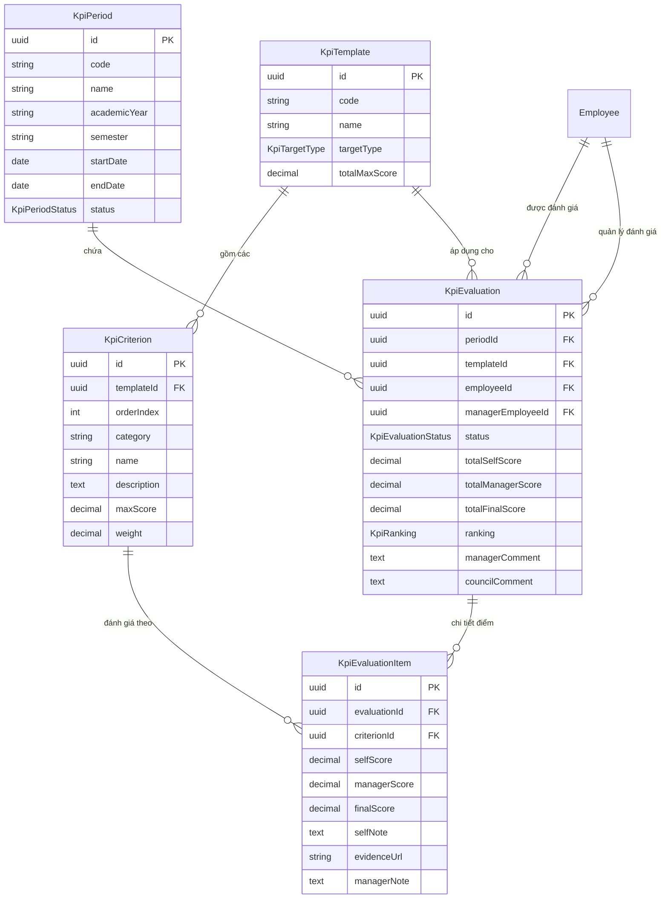

# ĐẶC TẢ YÊU CẦU NGHIỆP VỤ & KỸ THUẬT (PRD)
## PHÂN HỆ 5: ĐÁNH GIÁ KPI & XẾP LOẠI CÁN BỘ (PERFORMANCE & KPI EVALUATION)
### Hệ thống Quản trị Nhân sự Thông minh BAHAU — Trường Đại học Kiến trúc Đà Nẵng (DAU)

---

## 📌 1. TỔNG QUAN PHÂN HỆ & BỐI CẢNH

Công tác Đánh giá chất lượng và Xếp loại cán bộ, giảng viên, nhân viên là nhiệm vụ quản trị chiến lược thường niên tại Trường Đại học Kiến trúc Đà Nẵng (DAU). Phân hệ đảm bảo tính minh bạch, công bằng, gắn liền giữa hiệu quả công tác thực tế với chính sách thi đua, khen thưởng và phát triển nhân lực.

### 1.1. Mục tiêu Cốt lõi
1. **Phân hóa Mẫu Tiêu chí Đánh giá theo Đối tượng (Targeted KPI Templates)**:
   - **Mẫu Giảng viên (`LECTURER`)**: Tập trung vào 4 nhóm nhiệm vụ: Công tác giảng dạy & giáo dục, Nghiên cứu khoa học & chuyển giao công nghệ, Hoạt động phục vụ cộng đồng & nhà trường, Chấp hành kỷ luật & đạo đức nhà giáo.
   - **Mẫu Chuyên viên / Nhân viên (`STAFF`)**: Tập trung vào 4 nhóm nhiệm vụ: Khối lượng và tiến độ công việc hành chính, Chất lượng hoàn thành & sáng kiến cải tiến quy trình, Tác phong công tác & tinh thần phục vụ, Kỷ luật lao động & văn hóa công sở.
2. **Quy trình 4 Bước Đánh giá Khép kín (4-Step Evaluation Workflow)**:
   - **Bước 1**: Phòng TCHC mở kỳ đánh giá (`OPEN`).
   - **Bước 2**: CBGV tự chấm điểm (`selfScore`), giải trình thành tích và đính kèm link tài liệu minh chứng (`evidenceUrl`) $\rightarrow$ Nộp phiếu (`SUBMITTED`).
   - **Bước 3**: Trưởng khoa/phòng thẩm định minh chứng, chấm điểm quản lý (`managerScore`), ghi nhận xét (`managerComment`) $\rightarrow$ Chuyển Hội đồng (`IN_REVIEW`). Áp dụng Anti-Self-Approval.
   - **Bước 4**: Hội đồng Thi đua Khen thưởng / Ban Giám hiệu quyết định điểm tổng kết cuối cùng (`finalScore`) và xếp loại thi đua chuẩn $\rightarrow$ Công bố kết quả (`FINALIZED`).
3. **Quy chuẩn Xếp loại Thi đua Chuẩn DAU**:
   - **Hạng A - Hoàn thành xuất sắc nhiệm vụ (`EXCELLENT`)**: Điểm tổng kết $\ge 90$ (Tỷ lệ không quá 20% tổng số nhân sự theo quy định thi đua của Bộ GD&ĐT).
   - **Hạng B - Hoàn thành tốt nhiệm vụ (`GOOD`)**: Điểm tổng kết từ $70$ đến $< 90$.
   - **Hạng C - Hoàn thành nhiệm vụ (`SATISFACTORY`)**: Điểm tổng kết từ $50$ đến $< 70$.
   - **Hạng D - Không hoàn thành nhiệm vụ (`UNSATISFACTORY`)**: Điểm tổng kết $< 50$ hoặc bị kỷ luật.

---

## 👥 2. MA TRẬN PHÂN QUYỀN TRUY CẬP (RBAC & SCOPE)

| Hành động nghiệp vụ | Endpoint API | CBGVNV (`ROLE_EMPLOYEE`) | Trưởng đơn vị (`ROLE_UNIT_HEAD`) | Phòng TCHC (`ROLE_HR_OFFICER`) | Ban Giám hiệu (`ROLE_RECTOR`) | Quản trị (`ROLE_SYSADMIN`) |
| :--- | :--- | :---: | :---: | :---: | :---: | :---: |
| Tra cứu danh sách kỳ đánh giá | `GET /kpi/periods` | ✅ | ✅ | ✅ | ✅ | ✅ |
| Mở / Đóng kỳ đánh giá | `POST /kpi/periods` | ❌ | ❌ | ✅ | ✅ | ✅ |
| Tra cứu mẫu tiêu chí KPI | `GET /kpi/templates` | ✅ | ✅ | ✅ | ✅ | ✅ |
| Xem phiếu tự đánh giá cá nhân | `GET /kpi/evaluations/my` | `SCOPE_SELF` | `SCOPE_SELF` | `SCOPE_SELF` | `SCOPE_SELF` | `SCOPE_SELF` |
| Tự chấm điểm & gửi minh chứng | `POST /kpi/evaluations/my` | `SCOPE_SELF` | `SCOPE_SELF` | `SCOPE_SELF` | `SCOPE_SELF` | ❌ |
| Xem danh sách đánh giá đơn vị | `GET /kpi/evaluations/unit` | ❌ | `SCOPE_UNIT_TREE` | `SCOPE_ALL` | `SCOPE_ALL` | `SCOPE_ALL` |
| Trưởng đơn vị chấm điểm quản lý | `PUT /kpi/evaluations/:id/manager-score`| ❌ | `SCOPE_UNIT_TREE` | `SCOPE_ALL` | `SCOPE_ALL` | ❌ |
| Hội đồng chốt điểm & xếp loại A/B/C/D | `PUT /kpi/evaluations/:id/finalize` | ❌ | ❌ | ✅ | ✅ | ✅ |

---

## 🎯 3. DANH SÁCH USER STORIES (US)

### US-KP01: Tra cứu & Xem Phiếu Đánh Giá Cá Nhân Theo Kỳ
- **Người dùng**: Toàn thể CBGVNV (`ROLE_EMPLOYEE`).
- **Mục tiêu**: Chọn kỳ đánh giá và xem phiếu tự đánh giá được hệ thống tự động gán theo đúng đối tượng (Giảng viên hoặc Chuyên viên).
- **Tiêu chí chấp nhận (AC)**:
  1. Cho phép lựa chọn kỳ đánh giá trong danh sách các kỳ đã mở (`OPEN` hoặc `IN_REVIEW`).
  2. Tự động xác định mẫu phiếu: Nếu vị trí chức danh là Giảng viên $\rightarrow$ Tải mẫu `LECTURER`. Nếu là Chuyên viên/Nhân viên $\rightarrow$ Tải mẫu `STAFF`.
  3. Hiển thị tiến trình đánh giá: Đang tự chấm $\rightarrow$ Đã nộp $\rightarrow$ Đang thẩm định $\rightarrow$ Đã xếp loại.

### US-KP02: Tự Đánh Giá, Tự Chấm Điểm & Đính Kèm Minh Chứng
- **Người dùng**: Toàn thể CBGVNV.
- **Mục tiêu**: Nhập điểm tự chấm cho từng tiêu chí, giải trình thành tích và cung cấp đường dẫn minh chứng xác thực.
- **Tiêu chí chấp nhận (AC)**:
  1. Điểm tự chấm cho mỗi tiêu chí không được vượt quá `maxScore` của tiêu chí đó.
  2. Bắt buộc cung cấp đường dẫn minh chứng (`evidenceUrl`) đối với các tiêu chí Nghiên cứu khoa học, Bài báo quốc tế, Sáng kiến kinh nghiệm.
  3. Hỗ trợ chức năng **Lưu Nháp** (`isDraft = true`, trạng thái giữ nguyên `DRAFT`).
  4. Khi bấm **Nộp Phiếu Đánh Giá**: Kiểm tra hoàn thành tất cả tiêu chí, chuyển trạng thái sang `SUBMITTED`, gửi thông báo đến Trưởng đơn vị trực tiếp.

### US-KP03: Trưởng Đơn Vị Đánh Giá & Nhận Xét Cán Bộ Trực Thuộc
- **Người dùng**: Trưởng/Phó Khoa, Trưởng Bộ môn, Trưởng Phòng ban (`ROLE_UNIT_HEAD`).
- **Mục tiêu**: Thẩm định kết quả tự chấm của nhân sự trực thuộc, đối chiếu với tài liệu minh chứng và ghi nhận xét của cấp quản lý.
- **Tiêu chí chấp nhận (AC)**:
  1. Chỉ xem và đánh giá nhân sự thuộc đơn vị mình phụ trách (`SCOPE_UNIT_TREE`).
  2. **Anti-Self-Approval**: Trưởng đơn vị không được tự chấm điểm quản lý cho chính mình; phiếu của Trưởng đơn vị sẽ được phân công cho Ban Giám hiệu chấm.
  3. Nhập điểm quản lý (`managerScore`) cho từng tiêu chí và nhận xét chung (`managerComment`).
  4. Khi hoàn thành: Cập nhật `totalManagerScore`, chuyển trạng thái phiếu sang `IN_REVIEW`.

### US-KP04: Hội Đồng Thi Đua / BGH Phê Duyệt & Xếp Loại Thi Đua A/B/C/D
- **Người dùng**: Hội đồng Thi đua Khen thưởng, Ban Giám hiệu (`ROLE_RECTOR`), Phòng TCHC (`ROLE_HR_OFFICER`).
- **Mục tiêu**: Thẩm định kết quả toàn trường, quyết định điểm chính thức và phân hạng thi đua.
- **Tiêu chí chấp nhận (AC)**:
  1. Xem bảng tổng hợp kết quả toàn trường, tỷ lệ phân bổ xếp loại A/B/C/D.
  2. Quyết định điểm tổng kết `finalScore` và xếp hạng:
     - Loại A (`EXCELLENT`): $\ge 90$ điểm (Cảnh báo nếu vượt quá tỷ lệ 20% của đơn vị/trường).
     - Loại B (`GOOD`): $70 - 89$ điểm.
     - Loại C (`SATISFACTORY`): $50 - 69$ điểm.
     - Loại D (`UNSATISFACTORY`): $< 50$ điểm.
  3. Khi phê duyệt chốt: Trạng thái chuyển sang `FINALIZED`, dữ liệu trở thành bất biến.

### US-KP05: Quản Lý Kỳ Đánh Giá & Báo Cáo Thống Kê
- **Người dùng**: Phòng Tổ chức - Hành chính (`ROLE_HR_OFFICER`), Quản trị hệ thống (`ROLE_SYSADMIN`).
- **Mục tiêu**: Tạo mới kỳ đánh giá, thiết lập thời hạn nộp và xem báo cáo tỷ lệ hoàn thành.
- **Tiêu chí chấp nhận (AC)**:
  1. Tạo kỳ đánh giá: Mã kỳ, Tên kỳ, Năm học, Học kỳ, Ngày bắt đầu, Ngày kết thúc.
  2. Thống kê theo thời gian thực: Tỷ lệ nộp phiếu, Số lượng chưa nộp, Tỷ lệ hoàn thành theo từng khoa/phòng.

---

## 📋 4. BỘ TIÊU CHUẨN ĐÁNH GIÁ CHUẨN TRƯỜNG ĐH KIẾN TRÚC ĐÀ NẴNG (DAU)

### 4.1. Mẫu Tiêu chí Giảng viên (`LECTURER` - Tổng 100 điểm)
1. **Nhóm I: Công tác Giảng dạy & Giáo dục (40 điểm)**:
   - TC-GV1: Hoàn thành khối lượng giờ giảng dạy theo định mức (tối đa 20đ).
   - TC-GV2: Chất lượng giảng dạy, đổi mới phương pháp, phản hồi người học (tối đa 10đ).
   - TC-GV3: Chấm thi, coi thi, hướng dẫn đồ án tốt nghiệp, hướng dẫn NCKH sinh viên (tối đa 10đ).
2. **Nhóm II: Nghiên cứu Khoa học & Chuyển giao (30 điểm)**:
   - TC-GV4: Công bố bài báo khoa học quốc tế (ISI/Scopus) hoặc tạp chí chuyên ngành uy tín (tối đa 15đ - *Bắt buộc minh chứng*).
   - TC-GV5: Chủ trì/tham gia đề tài NCKH các cấp, biên soạn giáo trình, bài giảng chuyên đề (tối đa 15đ - *Bắt buộc minh chứng*).
3. **Nhóm III: Phục vụ Cộng đồng & Phát triển Trường (15 điểm)**:
   - TC-GV6: Tham gia ban đề thi, ban tuyển sinh, công tác cố vấn học tập, hoạt động đoàn thể (tối đa 10đ).
   - TC-GV7: Tham gia bồi dưỡng chuyên môn, hội thảo học thuật, kết nối doanh nghiệp kiến trúc/xây dựng (tối đa 5đ).
4. **Nhóm IV: Đạo đức Nhà giáo & Kỷ luật Lao động (15 điểm)**:
   - TC-GV8: Chấp hành chủ trương chính sách, nội quy nhà trường, tác phong văn hóa sư phạm (tối đa 15đ).

### 4.2. Mẫu Tiêu chí Chuyên viên / Nhân viên (`STAFF` - Tổng 100 điểm)
1. **Nhóm I: Khối lượng & Tiến độ Công việc (35 điểm)**:
   - TC-NV1: Hoàn thành đầy đủ khối lượng công việc được giao theo vị trí việc làm (tối đa 20đ).
   - TC-NV2: Tiến độ giải quyết công việc, không để tồn đọng hồ sơ thủ tục (tối đa 15đ).
2. **Nhóm II: Chất lượng & Sáng kiến Cải tiến (30 điểm)**:
   - TC-NV3: Chất lượng xử lý văn bản, tài liệu, hồ sơ chuyên môn đạt độ chính xác cao (tối đa 15đ).
   - TC-NV4: Đề xuất sáng kiến, giải pháp cải tiến quy trình công tác, ứng dụng CNTT (tối đa 15đ - *Bắt buộc minh chứng*).
3. **Nhóm III: Tác phong & Tinh thần Phục vụ (20 điểm)**:
   - TC-NV5: Tác phong làm việc chuẩn mực, tinh thần phối hợp công tác giữa các phòng ban (tối đa 10đ).
   - TC-NV6: Thái độ văn minh, nhã nhặn khi phục vụ giảng viên, sinh viên và khách liên hệ (tối đa 10đ).
4. **Nhóm IV: Kỷ luật & Văn hóa Công sở (15 điểm)**:
   - TC-NV7: Chấp hành giờ giấc làm việc, kỷ luật lao động, văn hóa công sở DAU (tối đa 15đ).

---

## 🗄️ 5. THIẾT KẾ MÔ HÌNH DỮ LIỆU PRISMA (DATA MODEL)

