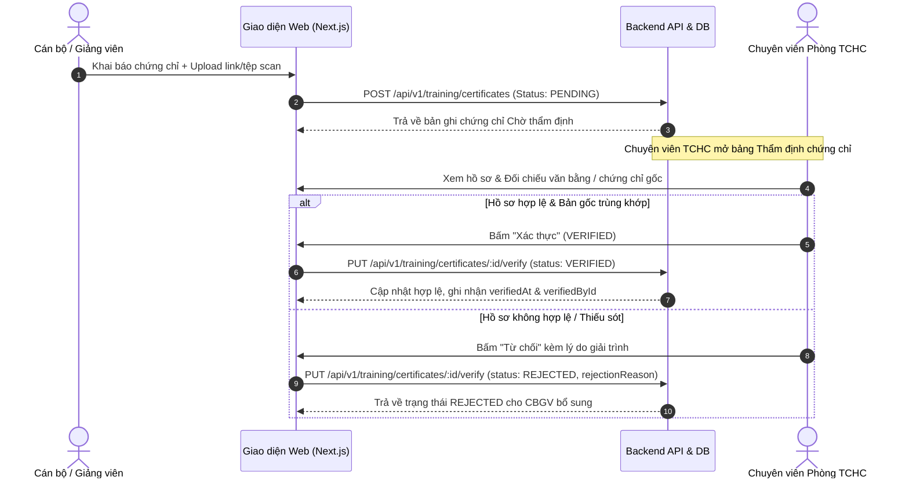
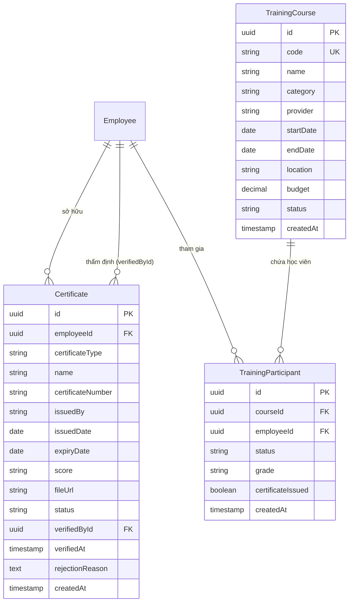

# ĐẶC TẢ YÊU CẦU NGHIỆP VỤ (PRD) — PHÂN HỆ 6
## Quản lý Đào tạo, Bồi dưỡng & Chứng chỉ (Training & Certification)
### Dự án BAHAU — Trường Đại học Kiến trúc Đà Nẵng (DAU)

---

## 📌 1. TỔNG QUAN & BỐI CẢNH ĐẶC THÙ TRƯỜNG ĐH KIẾN TRÚC ĐÀ NẴNG

### 1.1. Bối cảnh & Mục tiêu
Trường Đại học Kiến trúc Đà Nẵng (DAU) là cơ sở giáo dục đại học định hướng ứng dụng với khối ngành nòng cốt là **Kiến trúc - Quy hoạch**, **Xây dựng - Cầu đường**, **Công nghệ thông tin** và **Kinh tế - Quản trị**.
Đội ngũ Cán bộ, Giảng viên (CBGV) của Trường đòi hỏi tính chuẩn mực rất cao về mặt pháp lý và chuyên môn:
1. **Chứng chỉ hành nghề xây dựng/kiến trúc**: Điều kiện bắt buộc theo Luật Xây dựng và Luật Kiến trúc để giảng viên được tham gia hướng dẫn đồ án tốt nghiệp, chủ trì thiết kế và tham gia hội đồng chấm thi chuyên ngành.
2. **Chứng chỉ chức danh nghề nghiệp & Sư phạm đại học**: Tiêu chuẩn bổ nhiệm ngạch Giảng viên (Hạng III), Giảng viên chính (Hạng II), Giảng viên cao cấp (Hạng I) theo Thông tư của Bộ GD&ĐT.
3. **Năng lực Ngoại ngữ & Tin học ứng dụng**: Chứng chỉ chuẩn đầu ra giảng dạy bằng tiếng Anh (IELTS/VSTEP) và công nghệ chuyên ngành (BIM Revit, ArchiCAD, kết cấu SAP/ETABS).
4. **Quy trình thẩm định chặt chẽ**: Ngăn chặn chứng chỉ giả hoặc không hợp lệ bằng quy trình kiểm tra văn bằng gốc 2 bước tại Phòng Tổ chức - Hành chính.

---

## 👥 2. VAI TRÒ & PHÂN QUYỀN (RBAC)

| Mã Quyền | Tên Quyền | CBGV Cá nhân | Trưởng Đơn vị | Phòng TCHC | Ban Giám hiệu | Quản trị HT |
| :--- | :--- | :---: | :---: | :---: | :---: | :---: |
| `training:view_own_certificates` | Xem chứng chỉ cá nhân & cảnh báo hạn | ✅ | ✅ | ✅ | ✅ | ✅ |
| `training:submit_certificate` | Khai báo & tải scan chứng chỉ mới | ✅ | ✅ | ✅ | ✅ | ✅ |
| `training:view_all_certificates` | Tra cứu chứng chỉ toàn trường / theo khoa | ❌ | ✅ (Scope) | ✅ | ✅ | ✅ |
| `training:verify_certificate` | Thẩm định & xác nhận / từ chối chứng chỉ | ❌ | ❌ | ✅ | ❌ | ✅ |
| `training:view_courses` | Xem danh sách khóa bồi dưỡng | ✅ | ✅ | ✅ | ✅ | ✅ |
| `training:register_course` | Đăng ký tham gia khóa bồi dưỡng | ✅ | ✅ | ✅ | ✅ | ✅ |
| `training:manage_courses` | Mở khóa đào tạo & cập nhật kết quả | ❌ | ❌ | ✅ | ✅ | ✅ |

---

## 📑 3. DANH MỤC PHÂN LOẠI CHỨNG CHỈ CHUẨN DAU

### 3.1. Phân loại Loại Chứng chỉ (`CertificateType`)
1. `PROFESSIONAL_PRACTICE` (Chứng chỉ Hành nghề Chuyên môn):
   - Chứng chỉ Hành nghề Kiến trúc sư (Chủ trì thiết kế kiến trúc, Quy hoạch xây dựng).
   - Chứng chỉ Hành nghề Kỹ sư Xây dựng (Thiết kế kết cấu, Giám sát thi công xây dựng, Định giá xây dựng, Khảo sát địa chất).
   - Chứng chỉ An toàn vệ sinh lao động trong thi công công trình.
2. `ACADEMIC_TITLE_DEGREE` (Chức danh & Sư phạm Đại học):
   - Chứng chỉ Bồi dưỡng tiêu chuẩn chức danh nghề nghiệp Giảng viên đại học (Hạng I, Hạng II, Hạng III).
   - Chứng chỉ Bồi dưỡng Nghiệp vụ Sư phạm cho Giảng viên Đại học - Cao đẳng.
3. `LANGUAGE` (Chứng chỉ Ngoại ngữ):
   - IELTS, TOEFL iBT, TOEIC, Cambridge (CAE/CPE), VSTEP (B1, B2, C1 theo Khung năng lực ngoại ngữ 6 bậc Việt Nam).
4. `INFORMATICS` (Chứng chỉ Tin học & Công nghệ Chuyên ngành):
   - Ứng dụng Mô hình Thông tin Công trình (BIM Revit Architecture / Structure).
   - Phần mềm chuyên ngành: ArchiCAD, AutoCAD Professional, Rhinoceros & Grasshopper, SAP2000 / ETABS.
   - Tin học chuẩn kỹ năng CNTT nâng cao.
5. `POLITICAL_THEORY` (Lý luận Chính trị & Quản lý Nhà nước):
   - Lý luận chính trị (Sơ cấp, Trung cấp, Cao cấp).
   - Chứng chỉ Quản lý Nhà nước ngạch Chuyên viên / Chuyên viên chính.
6. `OTHER` (Chứng chỉ khác):
   - Các khóa tập huấn ngắn hạn, kỹ năng mềm, phương pháp nghiên cứu khoa học.

---

## 🔄 4. QUY TRÌNH NGHIỆP VỤ CỐT LÕI

### 4.1. Quy trình Thẩm định Chứng chỉ 2 Bước (Certificate Verification)

### 4.2. Bộ Cảnh báo Hạn Chứng chỉ Chủ động (Certificate Expiry Alert Engine)

Đối với các chứng chỉ có thời hạn (chứng chỉ hành nghề xây dựng/kiến trúc: 5 năm, chứng chỉ IELTS/VSTEP: 2 năm):
$$\Delta = \text{expiryDate} - \text{today (ngày)}$$

| Khoảng thời gian $\Delta$ | Mã Cảnh báo | Mức độ Nghiêm trọng | Biện pháp Xử lý của DAU |
| :--- | :--- | :--- | :--- |
| $\Delta < 0$ | `EXPIRED` | 🔴 Quá hạn | Tạm dừng phân công hội đồng chấm đồ án / hướng dẫn tốt nghiệp |
| $0 \le \Delta \le 30$ | `CRITICAL_30` | 🟠 Khẩn cấp $\le 30$ ngày | Nhắc nhở khẩn yêu cầu CBGV nộp hồ sơ gia hạn hoặc thi bổ sung |
| $31 \le \Delta \le 60$ | `WARNING_60` | 🟡 Cảnh báo $\le 60$ ngày | Thông báo đến Trưởng Khoa để chủ động phương án nhân sự |
| $61 \le \Delta \le 90$ | `WARNING_90` | 🔵 Nhắc nhở $\le 90$ ngày | Gửi thông báo tự động tới tài khoản cá nhân của CBGV |
| $\Delta > 90$ | `VALID` | 🟢 An toàn | Chứng chỉ còn thời hạn hợp lệ |

---

## 🗄️ 5. MÔ HÌNH DỮ LIỆU THỰC THỂ (ERD)

---

## 🎯 6. TIÊU CHÍ NGHIỆM THU (ACCEPTANCE CRITERIA)
- **AC-TR-01**: CBGV có thể nộp và tra cứu toàn bộ chứng chỉ cá nhân trên giao diện web `/training`.
- **AC-TR-02**: Mọi chứng chỉ mới khởi tạo đều có trạng thái `PENDING` và không thể tự chuyển sang `VERIFIED` bởi CBGV thông thường.
- **AC-TR-03**: Chuyên viên Phòng TCHC có quyền phê duyệt `VERIFIED` hoặc từ chối `REJECTED` kèm lý do rõ ràng.
- **AC-TR-04**: Hệ thống tự động tính toán chính xác 5 mốc cảnh báo thời hạn chứng chỉ (`EXPIRED`, `CRITICAL_30`, `WARNING_60`, `WARNING_90`, `VALID`).
- **AC-TR-05**: Danh mục khóa đào tạo cho phép tạo mới, đăng ký và theo dõi danh sách học viên bồi dưỡng.
