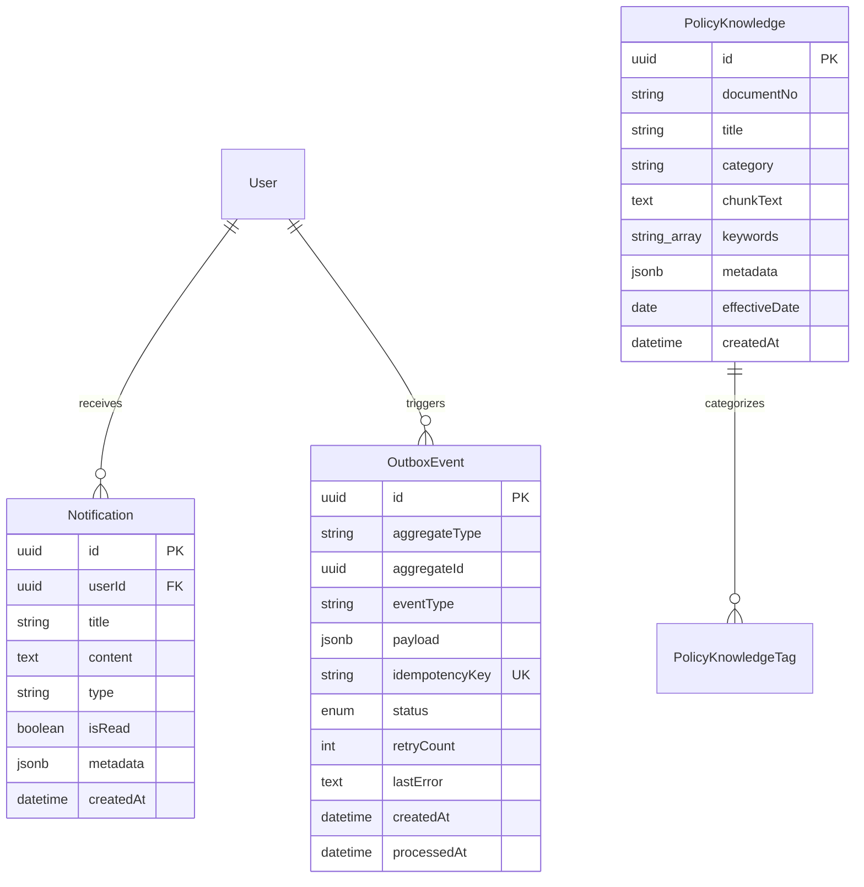

# ĐẶC TẢ YÊU CẦU NGHIỆP VỤ (PRD) — PHÂN HỆ 7
## Dashboard Điều hành Lãnh đạo, Worker Tác vụ Nền & Trợ lý ảo AI (Executive Dashboard, Outbox Worker & DAU Policy AI Assistant)
### Dự án BAHAU — Trường Đại học Kiến trúc Đà Nẵng (DAU)

---

## 📌 1. TỔNG QUAN & BỐI CẢNH ĐẶC THÙ TRƯỜNG ĐH KIẾN TRÚC ĐÀ NẴNG

### 1.1. Bối cảnh & Mục tiêu
Trường Đại học Kiến trúc Đà Nẵng (DAU) với quy mô hơn 400 cán bộ, giảng viên, nhà khoa học chuyên ngành Kiến trúc, Xây dựng, CNTT và Kinh tế, đòi hỏi công tác quản trị nhân sự phải:
1. **Dữ liệu hóa & Trực quan hóa công tác điều hành**: Ban Giám hiệu và Trưởng các Khoa/Phòng cần cái nhìn toàn cảnh về cơ cấu đội ngũ (tỷ lệ Tiến sĩ, Thạc sĩ, Kiến trúc sư có chứng chỉ hành nghề), tình hình hợp đồng, biến động nhân sự để hoạch định chiến lược đào tạo và mở ngành mới.
2. **Xử lý tác vụ nền & Thông báo tự động không mất mát (Transactional Outbox)**: Mọi sự kiện nghiệp vụ (nộp đơn xin nghỉ, phê duyệt đi công tác, thẩm định chứng chỉ, cảnh báo hợp đồng sắp hết hạn) phải được lưu trữ an toàn trong cùng giao dịch cơ sở dữ liệu và được tiến trình Worker gửi thông báo tin cậy đến người dùng (In-app notification và Email).
3. **Trợ lý ảo AI Assistant am hiểu Quy chế DAU (Policy RAG)**: Giúp Cán bộ, Giảng viên tra cứu nhanh chóng, chính xác các quy định nội bộ của Trường (quy chế làm việc, định mức giờ chuẩn giảng dạy 270 giờ/năm, chế độ nghỉ hè và nghỉ phép thường niên, tiêu chuẩn nâng bậc lương, tỷ lệ khen thưởng thi đua), đồng thời hỗ trợ tra cứu số dư cá nhân và khởi tạo đơn nháp có xác nhận an toàn.

---

## 👥 2. VAI TRÒ & PHÂN QUYỀN (RBAC)

| Mã Quyền | Tên Quyền | CBGV Cá nhân | Trưởng Đơn vị | Phòng TCHC | Ban Giám hiệu | Quản trị HT |
| :--- | :--- | :---: | :---: | :---: | :---: | :---: |
| `dashboard:view_overview` | Xem Dashboard điều hành tổng quan | ❌ | ✅ (Scope khoa) | ✅ | ✅ | ✅ |
| `dashboard:view_workforce_stats` | Thống kê cơ cấu học vị, chức danh, hợp đồng | ❌ | ✅ (Scope khoa) | ✅ | ✅ | ✅ |
| `dashboard:view_alerts` | Xem danh sách cảnh báo điều hành tập trung | ❌ | ✅ (Scope khoa) | ✅ | ✅ | ✅ |
| `notification:view_own` | Xem danh sách thông báo cá nhân | ✅ | ✅ | ✅ | ✅ | ✅ |
| `notification:mark_read` | Đánh dấu đã đọc thông báo | ✅ | ✅ | ✅ | ✅ | ✅ |
| `ai:chat` | Hỏi đáp trợ lý ảo & tra cứu quy chế DAU | ✅ | ✅ | ✅ | ✅ | ✅ |
| `worker:process_outbox` | Kích hoạt quét hàng đợi Outbox thủ công | ❌ | ❌ | ❌ | ❌ | ✅ |

---

## 📑 3. CÁC TÍNH NĂNG NGHIỆP VỤ CỐT LÕI

### 3.1. Executive Dashboard (Màn hình Điều hành Lãnh đạo)
- **Chỉ số Vận hành Tổng quan (Overview KPI Cards)**:
  - Tổng số CBGV toàn trường và tỷ lệ theo trạng thái công tác (`ACTIVE`, `PROBATION`, `ON_LEAVE`).
  - Tỷ lệ học vị trình độ cao: Tỷ lệ Tiến sĩ (`DOCTOR`), Thạc sĩ (`MASTER`), Cử nhân/KTS/Kỹ sư (`BACHELOR`).
  - Tỷ lệ chức danh học thuật: Giáo sư (`PROFESSOR`), Phó Giáo sư (`ASSOCIATE_PROFESSOR`), Giảng viên chính/Giảng viên.
  - Tỷ lệ Giảng viên có chứng chỉ hành nghề Kiến trúc sư / Kỹ sư Xây dựng hợp lệ.
- **Biểu đồ Cơ cấu Nhân sự (Workforce Composition)**:
  - Phân bố Vị trí việc làm: Cán bộ Quản lý (`MANAGEMENT`), Giảng viên Giảng dạy (`ACADEMIC`), Chuyên viên Hành chính (`ADMINISTRATIVE`).
  - Phân loại Hợp đồng lao động: Không xác định thời hạn, 12-36 tháng, Thỉnh giảng, Thử việc.
- **Dòng Biến động Nhân sự (Personnel Turnover Feed)**:
  - Tuyển dụng mới (`HIRED`), Bổ nhiệm chức vụ (`APPOINTED`), Luân chuyển đơn vị (`TRANSFERRED`), Nghỉ hưu/Thôi việc (`RETIRED`/`RESIGNED`) từ bảng `EmploymentEvent`.
- **Trung tâm Cảnh báo Điều hành Tập trung (Centralized Alert Stream)**:
  - Cảnh báo Hợp đồng sắp hết hạn trong 30 và 60 ngày.
  - Cảnh báo Chứng chỉ hành nghề KTS/Kỹ sư và chứng chỉ sư phạm sắp hết hạn hoặc đã quá hạn.
  - Cảnh báo Tồn đọng Hành chính: Số lượng đơn nghỉ phép, phiếu tự chấm KPI và chứng chỉ đang chờ phê duyệt.

### 3.2. Background Worker & Transactional Outbox Pattern
- **Kiến trúc Transactional Outbox**:
  - Dữ liệu sự kiện được ghi vào bảng `outbox_events` cùng Transaction ACID với thay đổi nghiệp vụ.
  - Trạng thái vòng đời sự kiện: `PENDING` $\rightarrow$ `PROCESSING` $\rightarrow$ `PROCESSED` (hoặc `FAILED` nếu vượt quá 3 lần retry).
- **Trình điều phối Sự kiện (Event Dispatcher)**:
  - Xử lý các sự kiện nghiệp vụ: `LEAVE_REQUEST_SUBMITTED`, `LEAVE_REQUEST_APPROVED`, `LEAVE_REQUEST_REJECTED`, `CONTRACT_EXPIRING_WARNING`, `CERTIFICATE_EXPIRING_WARNING`, `KPI_PERIOD_OPENED`.
  - Tự động sinh bản ghi thông báo trong bảng `notifications` tương ứng cho người nhận (CBGV nộp đơn, Trưởng khoa, Chuyên viên TCHC).
  - Ghi nhận nhật ký phân phối (Delivery Attempt) và mô phỏng gửi email thông báo.
- **Quản lý Thông báo Người dùng (In-app Notification Hub)**:
  - CBGV nhận thông báo trực quan trên thanh Menu (icon Chuông với số lượng chưa đọc).
  - Xem danh sách thông báo theo thứ tự thời gian mới nhất.
  - Đánh dấu đã đọc từng thông báo hoặc toàn bộ thông báo.

### 3.3. Trợ lý ảo AI Assistant (DAU Policy RAG Agent)
- **Cơ sở Tri thức Quy chế Nội bộ DAU (DAU Policy Knowledge Base)**:
  - Lưu trữ các quyết định, quy chế pháp quy của Trường ĐH Kiến trúc Đà Nẵng:
    1. *Quyết định số 128/QĐ-ĐHKT*: Quy chế làm việc & Định mức giờ chuẩn Giảng viên (270 giờ chuẩn/năm, định mức giảm trừ cho CBGV kiêm nhiệm quản lý).
    2. *Quyết định số 45/QĐ-ĐHKT*: Quy định chế độ Nghỉ phép thường niên CBGV (12 ngày chuẩn + thâm niên 5 năm tăng 1 ngày, quy định thời gian nghỉ hè của Giảng viên).
    3. *Quy định số 89/QyĐ-ĐHKT*: Quy định chế độ nâng bậc lương thường xuyên và nâng lương trước thời hạn (3 năm đối với cử nhân, 2 năm đối với thạc sĩ/tiến sĩ; nâng lương sớm tối đa 6 tháng cho cá nhân đạt thi đua Loại A).
    4. *Quyết định số 210/QĐ-ĐHKT*: Quy chế đánh giá KPI & Thi đua khen thưởng (Khống chế tối đa 20% Loại A, cơ chế tự chấm và Hội đồng chốt điểm).
    5. *Quy định số 15/QyĐ-ĐHKT*: Tiêu chuẩn bổ nhiệm ngạch Giảng viên & Yêu cầu chứng chỉ hành nghề KTS/Kỹ sư xây dựng.
- **Bộ máy Tìm kiếm Tri thức Lai (Hybrid Keyword & Semantic RAG Search)**:
  - Phân tích câu hỏi của người dùng và truy xuất đoạn văn bản quy chế có điểm liên quan cao nhất.
  - Phản hồi câu trả lời rõ ràng kèm trích dẫn văn bản số hiệu và điều khoản cụ thể.
- **Hỗ trợ Tra cứu Dữ liệu Thực tế Cá nhân (Contextual Profile Lookup)**:
  - Khi CBGV hỏi về dữ liệu của mình (ví dụ: "Tôi còn bao nhiêu ngày phép trong năm nay?", "Hợp đồng lao động hiện tại của tôi khi nào hết hạn?"), AI Assistant tự động lấy dữ liệu từ tài khoản đăng nhập và phản hồi chính xác.
- **Hỗ trợ Khởi tạo Đơn Nháp Thông minh (Smart Draft Creation with Human Confirmation)**:
  - Khi CBGV yêu cầu soạn đơn (ví dụ: "Soạn giúp tôi đơn xin nghỉ phép 2 ngày đi việc gia đình từ ngày mai"), AI Assistant phân tích thông tin và tạo bản đề xuất đơn nháp.
  - Hiển thị hộp xác nhận `Draft Proposal Preview` với thông tin chi tiết. Người dùng nhấn nút "Xác nhận gửi đơn" thì đơn mới chính thức được ghi vào hệ thống Workflow.

---

## 🗄️ 4. MÔ HÌNH DỮ LIỆU BỔ SUNG

---

## 🚀 5. TIÊU CHÍ NGHIỆM THU (DoD)
1. **Database & Migrations**: Thêm model `Notification` và `PolicyKnowledge`, cập nhật seed dữ liệu tri thức quy chế DAU.
2. **Contracts**: Khai báo đầy đủ schemas Zod cho Dashboard stats, Outbox batch trigger, Notification DTOs và AI Chat request/response.
3. **Backend API**:
   - `GET /api/v1/dashboard/overview`, `GET /api/v1/dashboard/workforce-stats`, `GET /api/v1/dashboard/alerts`.
   - `POST /api/v1/worker/outbox/process-batch`.
   - `GET /api/v1/notifications/my`, `PATCH /api/v1/notifications/:id/read`, `POST /api/v1/notifications/read-all`.
   - `POST /api/v1/ai/chat`, `GET /api/v1/ai/policies`.
4. **Frontend UI**:
   - Màn hình `/dashboard` trực quan với biểu đồ phân bố và danh sách cảnh báo tập trung.
   - Màn hình `/ai-assistant` giao diện chat thông minh với RAG trích dẫn quy chế DAU và tạo đơn nháp.
   - Icon Chuông thông báo trên Header kèm popover/badge realtime.
5. **Kiểm thử**: `tests/dashboard-ai-endpoints.test.mjs` PASS 100% và `runner.mjs --all` đạt 40/40 test cases.
