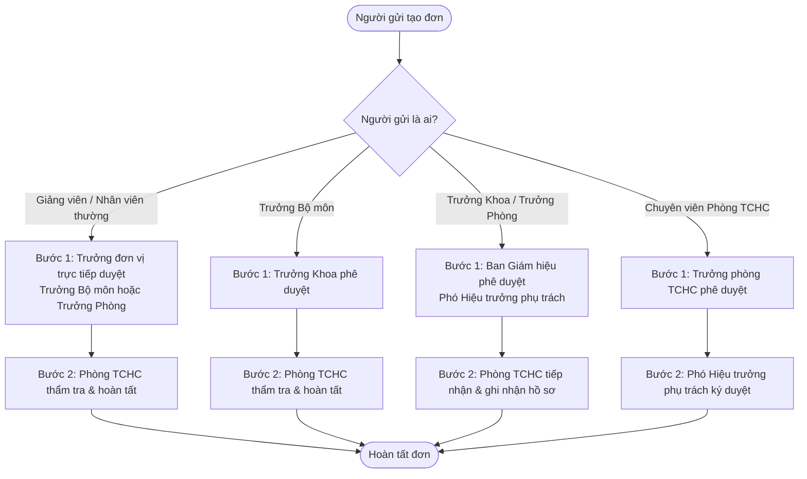

# MA TRẬN PHÂN QUYỀN ĐA CHIỀU (RBAC & SCOPE MATRIX)
## Hệ thống Quản trị Nhân sự Thông minh - Trường Đại học Kiến trúc Đà Nẵng (DAU)

---

### 1. Nguyên tắc Phân quyền
Hệ thống áp dụng mô hình phân quyền ma trận kết hợp giữa **Role-Based Access Control (RBAC)** và **Organizational Scope Filter (Phạm vi đơn vị)**:
$$\text{Quyền thực thi} = \text{Vai trò (Role)} + \text{Phạm vi đơn vị (Data Scope)} + \text{Quan hệ sở hữu (Ownership)} + \text{Trạng thái nghiệp vụ (State)}$$

1. **Kiểm tra tại tầng Backend API**:
   - Ẩn/hiện nút trên giao diện Next.js chỉ có giá trị hỗ trợ trải nghiệm người dùng.
   - Mọi API endpoint của Express đều có Middleware kiểm tra quyền chặt chẽ trên từng bản ghi.
2. **Không gian làm việc tương ứng**:
   - Vai trò quyết định người dùng được vào những không gian nào trong 3 Không gian: Cá nhân, Quản lý đơn vị, Nhân sự/Quản trị.
3. **Quy tắc Chống tự phê duyệt (Zero Self-Approval Rule)**:
   - Người tạo đơn không bao giờ được phép duyệt đơn của chính mình ở bất kỳ cấp duyệt nào.

---

### 2. Định nghĩa 5 Nhóm Người dùng Chính tại DAU

| Mã vai trò | Tên vai trò | Đối tượng thực tế tại DAU | Không gian làm việc được phép |
| :--- | :--- | :--- | :--- |
| `ROLE_EMPLOYEE` | Cán bộ / Giảng viên / Nhân viên | Toàn bộ giảng viên cơ hữu, thỉnh giảng, chuyên viên, nhân viên các phòng ban | Không gian Cá nhân |
| `ROLE_UNIT_HEAD` | Quản lý Đơn vị | Trưởng/Phó Khoa, Trưởng/Phó Phòng ban, Trưởng Bộ môn | Không gian Cá nhân, Không gian Quản lý Đơn vị |
| `ROLE_HR_OFFICER` | Chuyên viên Nhân sự | Chuyên viên và Lãnh đạo Phòng Tổ chức - Hành chính | Cá nhân, Quản lý đơn vị, Không gian Nhân sự/Quản trị |
| `ROLE_RECTOR` | Ban Giám hiệu / Lãnh đạo | Hiệu trưởng, các Phó Hiệu trưởng | Cả 3 không gian (Được phân công duyệt và xem báo cáo) |
| `ROLE_SYSADMIN` | Quản trị Hệ thống | Đội ngũ kỹ thuật viên quản trị ứng dụng và hạ tầng | Không gian Nhân sự/Quản trị (Cấu hình kỹ thuật, log) |

---

### 3. Định nghĩa Phạm vi Dữ liệu (Data Scope Hierarchy)

Khi một vai trò có quyền thao tác trên một module, quyền đó được giới hạn bởi **Scope**:
- **`SCOPE_SELF`**: Chỉ được đọc/sửa dữ liệu thuộc về chính mình (`record.employeeId == session.employeeId`).
- **`SCOPE_DIRECT_UNIT`**: Chỉ truy cập dữ liệu nhân sự thuộc đúng đơn vị mà người đó làm lãnh đạo trực tiếp.
- **`SCOPE_UNIT_TREE`**: Truy cập dữ liệu của đơn vị phụ trách và toàn bộ các đơn vị con (ví dụ: Trưởng khoa được quản lý nhân sự thuộc Khoa và toàn bộ các Bộ môn con trực thuộc Khoa).
- **`SCOPE_ALL`**: Toàn bộ nhân sự và dữ liệu của tất cả các đơn vị trong Trường Đại học Kiến trúc Đà Nẵng.

---

### 4. Bảng Ma trận Quyền Chi tiết (Granular Permission Matrix)

#### Ký hiệu:
- **ALL**: Toàn quyền toàn trường.
- **TREE**: Đơn vị quản lý và các đơn vị trực thuộc.
- **SELF**: Chỉ bản thân.
- **NONE**: Không có quyền.

| Phân hệ / Nghiệp vụ | Mã quyền (Permission Code) | CBGVNV (`EMPLOYEE`) | Trưởng đơn vị (`UNIT_HEAD`) | Phòng Nhân sự (`HR_OFFICER`) | Ban Giám hiệu (`RECTOR`) | Quản trị viên (`SYSADMIN`) |
| :--- | :--- | :---: | :---: | :---: | :---: | :---: |
| **Hồ sơ cá nhân** | `employee:read_basic` | SELF | TREE | ALL | ALL | ALL |
| | `employee:read_sensitive` (CCCD, thuế, lương) | SELF | NONE | ALL | ALL | NONE *(Tránh lộ dữ liệu)* |
| | `employee:update_contact` (SĐT, địa chỉ) | SELF | NONE | ALL | NONE | NONE |
| | `employee:update_official` (Bằng cấp, học hàm) | Gửi đơn xác nhận | Duyệt bước 1 | Phê duyệt chính thức | Xem xét | NONE |
| **Cơ cấu tổ chức** | `unit:read_tree` | Toàn trường | Toàn trường | Toàn trường | Toàn trường | Toàn trường |
| | `unit:manage_structure` | NONE | NONE | Đề xuất/Soạn thảo | Phê duyệt | Cấu hình kỹ thuật |
| **Hợp đồng lao động** | `contract:read_own` | SELF | NONE | ALL | ALL | NONE |
| | `contract:read_unit` | NONE | TREE | ALL | ALL | NONE |
| | `contract:create_amend` | NONE | NONE | ALL | Ký duyệt | NONE |
| **Nghỉ phép** | `leave:create_request` | SELF | SELF | SELF | SELF | NONE |
| | `leave:approve_level_1` | NONE | TREE | NONE *(Trừ nhân sự nội bộ)* | NONE | NONE |
| | `leave:approve_hr` | NONE | NONE | ALL | NONE | NONE |
| | `leave:view_ledger` | SELF | TREE | ALL | ALL | NONE |
| | `leave:adjust_ledger` | NONE | NONE | ALL *(Có lý do)* | NONE | NONE |
| **Công tác** | `trip:create_request` | SELF | SELF | SELF | SELF | NONE |
| | `trip:approve` | NONE | TREE | ALL *(Thẩm tra)* | Ký quyết định | NONE |
| **Chấm công** | `attendance:view_own` | SELF | SELF | SELF | SELF | NONE |
| | `attendance:view_unit` | NONE | TREE | ALL | ALL | NONE |
| | `attendance:import_raw` | NONE | NONE | ALL | NONE | NONE |
| | `attendance:adjust_request` | SELF | Xác nhận TREE | Phê duyệt | NONE | NONE |
| | `attendance:lock_period` | NONE | NONE | Khóa kỳ công | Xem | NONE |
| **Báo cáo & Dashboard** | `report:dashboard_unit` | NONE | TREE | ALL | ALL | NONE |
| | `report:dashboard_rector` | NONE | NONE | Xem phối hợp | ALL | NONE |
| **Quản trị hệ thống** | `system:manage_users` | NONE | NONE | Quản lý tài khoản NV | Xem | Quản lý tài khoản toàn hệ thống |
| | `system:view_audit_logs` | NONE | NONE | Nhật ký nghiệp vụ | Nhật ký nghiệp vụ | Toàn bộ Audit Log hệ thống |
| | `system:backup_restore` | NONE | NONE | NONE | NONE | Quản trị vận hành |

---

### 5. Quy tắc Xử lý Chuỗi Phê duyệt Tự động (Hierarchical Escalation Engine)

Để tránh xung đột lợi ích và lỗi tự phê duyệt:

- **Quy tắc khuyết vị trí**: Nếu một đơn vị chưa được bổ nhiệm người đứng đầu (`managerEmployeeId IS NULL`), workflow tự động chuyển tiếp đơn lên cấp quản lý của đơn vị cha trong cây tổ chức.
- **Quy tắc khóa sửa đổi khi đang duyệt**: Khi đơn ở trạng thái `PENDING_APPROVAL`, người gửi không được phép sửa dữ liệu. Nếu cần thay đổi thông tin quan trọng (thời gian nghỉ, địa điểm công tác), bắt buộc phải thực hiện thao tác "Rút đơn/Hủy đơn" để tạo đơn mới hoặc người duyệt bấm "Yêu cầu bổ sung" để mở lại quyền sửa.
